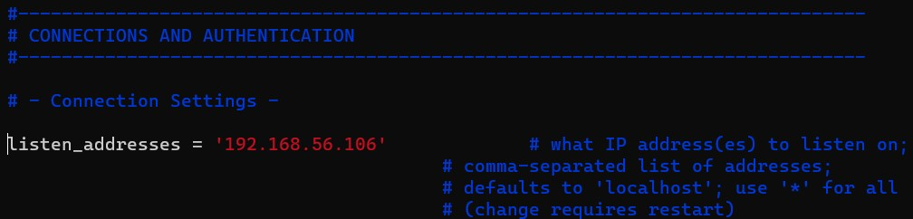
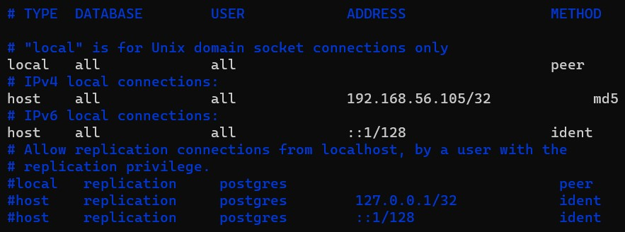
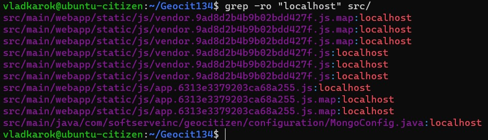
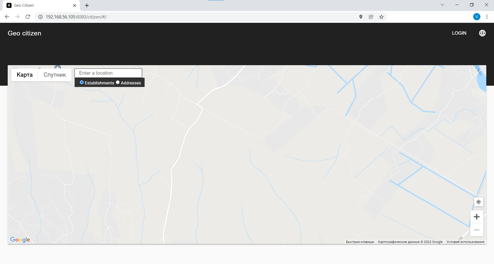
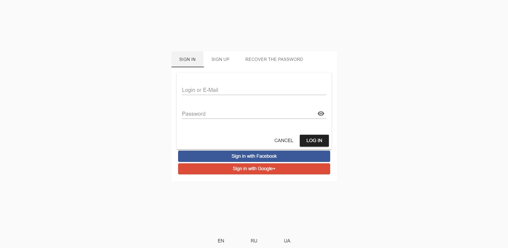
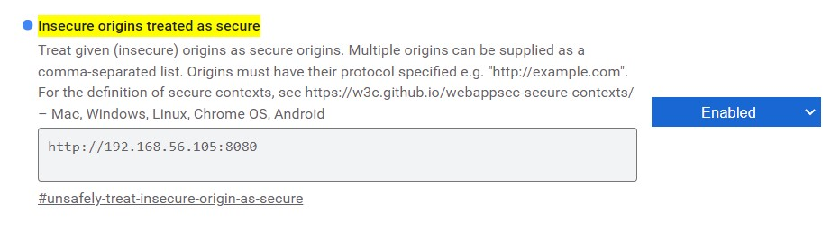

# Geo citizen


**Table of Contents**  
  - [Manual installation](#manual-installation)
    - [Task](#task)
    - [Requirements](#requirements)
    - [Possible problem in Centos with second network adapter](#possible-problem-in-centos-with-second-network-adapter)
    - [Preparation](#preparation)
      - [SSH key authorization](#ssh-key-authorization)
      - [Easing ssh connection](#easing-ssh-connection)
      - [Installing and configuring pre required software](#installing-and-configuring-pre-required-software)
        - [Centos - PostgreSQL](#centos---postgresql)
        - [Ubuntu - tomcat, jdk, mvn](#ubuntu---tomcat-jdk-mvn)
    - [Clonning, fixing and running the project](#clonning-fixing-and-running-the-project)
      - [Fixing pom.xml](#fixing-pomxml)
      - [Fixing application.properties](#fixing-applicationproperties)
      - [And some more fixes](#and-some-more-fixes)
      - [Building project](#building-project)
      - [Access and test](#access-and-test)
    - [Appendix](#appendix)
      - [Allow geolocation on insecure resourses](#allow-geolocation-on-insecure-resourses)
      - [Some useful things](#some-useful-things)
      - [Remove password prompt when using `sudo`](#remove-password-prompt-when-using-sudo)
      - [Adding some automation](#adding-some-automation)

## Manual installation
### Task
**Install [project](https://github.com/mentorchita/Geocit134) using Ubuntu for web and Centos for database.**


### Requirements

We will use Virtualbox on Windows (can be downloaded [here](https://www.virtualbox.org/wiki/Downloads) as hypervisor for Ubuntu and Centos virtual machines.
For Ubuntu we will use next version - [Ubuntu Server 20.04.3 LTS](https://releases.ubuntu.com/20.04/ubuntu-20.04.3-live-server-amd64.iso.torrent?_ga=2.115100164.244318738.1644355101-915704212.1643474286) and for Centos - [CentOS 7.9.2009](http://ftp.rz.uni-frankfurt.de/pub/mirrors/centos/7.9.2009/isos/x86_64/CentOS-7-x86_64-DVD-2009.torrent) or you can choose another source from Centos [mirrors](http://isoredirect.centos.org/centos/7/isos/x86_64/).
Donwload images, create two virtual machines. Amount of RAM, CPU and storage are not critical, but do not give too little. One setting we want to mention - network. As we want our virtual machines to communicate with each other and we need internet for package installing and so on, we have several options, but we recommend the next one: two virtual adapters, one configured as NAT (for internet access, but host and guest machines can't communicate through it) and another - as Host-only Adapter.


You may check the settings last adapter in Virtualbox menu (File/Host Network Manager) It should be one or more adapters created, must be present ip addresses and DHCP server enabled.

For example:


### Possible problem in Centos with second network adapter

After Centos installation you may face one problem - only one network adapter is working.
1. First type 
```
ip a
 ```

and find which adapter has IP address and which not, and their names. Usually the one that is in **NAT** mode has 10.0.\*.\*/24 address and default route enabled (that information will be used further), and the one in **Virtualbox Host-only Adapter's** mode has the network you specified in configuration previously, and it shouldn't has default route.

2. Instruct the system to **list your network devices** with the command:
```
nmcli d
```


*(you may see one of the adapters is in "red" state, like disconnected)*

Find the network you want to configure for DHCP and copy its name.

3. Then, **open the appropriate configuration file**. Use the following command and paste the device name that is in "red state" (may not be the same as in example image!) at the end:
```
sudo vi /etc/sysconfig/network-scripts/ifcfg-[network_device_name]
```
4. A text editor with the network configuration opens.
5. The `BOOTPROTO` line should have the value **"dhcp"** and change the `ONBOOT` line to **"yes"** to enable the network. `DEFROUTE` should be set to **"no"** in case this is the **Virtualbox Host-only Adapter's** interface.


6. **Save** the file and exit to return to the command line.

7. Finally, **restart the network** with:

```
sudo systemctl restart network
```

### Preparation

#### SSH key authorization

1) Generate rsa key pair. Open terminal on your host machine (on Windows we recommend [Windows Terminal](https://docs.microsoft.com/en-us/windows/terminal/install)) and type the following command at the prompt then press enter.
```
ssh-keygen -b 4096
```
When prompted for the file in which to save the key, press enter. The default location will be created.

(Optional, but recommended) Enter a passphrase when prompted.
The whole process will look like this:


2) Login to your previously installed server with login and password you've created during installation using ssh
```
ssh username@server_ip_address
```
3) Create directory **.ssh** and file in it **authorized_keys** executing command
```
mkdir ~/.ssh && vi ~/.ssh/authorized_keys
```
4) Open another terminal on your host machine and type
```
cat ~/.ssh/id_rsa.pub
```
(where **id_rsa.pub** - name of key pair you generated on first step)
The output should be something like this, but now exactly like this


Copy the output and open back firts terminal with the server's open **authorized_keys** file and paste there, save the file and exit.

5) Change the permission of the **.ssh** directory and **authorized_keys** file:

```
chmod 644 ~/.ssh
chmod 600 ~/.ssh/authorized_keys
```

6) Next we have to edit our ssh servers configuration

```
sudo vi /etc/ssh/sshd_config
```

Set the following lines to:

```
PermitRootLogin no
PubkeyAuthentication yes
PermitEmptyPasswords no
PasswordAuthentication no
```
Those lines are not near each other, just search them in the config file.

7) Restart ssh server

```
sudo systemctl restart sshd
```

8) IMPORTANT! Open **another one** terminal and try to connect to the server

```
ssh username@servers_ip_address -i ~/.ssh/test_rsa
```

Where *-i* specifies the **private key file** you generated previously.
If you can connect to the server - you can close previous terminal.


This settings are the same for Centos and Ubuntu.


#### Easing ssh connection

You can create in ~/.ssh (C:/Users/Your_users_name/.ssh) directory file **config** (without extension) where you can specify settings for connections. Let's create ones. Open file and insert for example the following:

```
Host ubuntu-citizen
         HostName 192.168.56.105
         Port 22
         Forwardx11 no
         User vladkarok
         IdentityFile ~/.ssh/id_rsa
         Protocol 2
         Compression no
         ServerAliveInterval 60
         ServerAliveCountMax 20
         LogLevel Info
		 	 
Host centos-citizen
         HostName 192.168.56.106
         Port 22
         Forwardx11 no
         User vladkarok
         IdentityFile ~/.ssh/id_rsa
         Protocol 2
         Compression no
         ServerAliveInterval 60
         ServerAliveCountMax 20
         LogLevel Info	
```

Where **192.168.56.105/192.168.56.106** - IP addresses of your servers, **vladkarok** - username to login, **~/.ssh/id_rsa** - path to private key we've generated, other parameters you can leave as above.

So, now we can type in terminal short command like

```
ssh centos-citizen
```

and we are in!


#### Installing and configuring pre required software
##### Centos - PostgreSQL

[Source](https://linuxize.com/post/how-to-install-postgresql-on-centos-7/)

First we need to enable *Extra Packages for Enterprise Linux*
```
sudo yum -y install epel-release
```
Then we can update our repositories
```
sudo yum -y update
```
And now we can install PostgreSQL and vim (because why not)
```
sudo yum -y install postgresql-server postgresql-contrib vim
```
Initializing Database
```
sudo postgresql-setup initdb
```
To start the PostgreSQL service and enable it to start on boot
```
sudo systemctl start postgresql
sudo systemctl enable postgresql
```
Now we need to create PostgreSQL Role and Database. Connect to PostgreSQL shell
```bash
sudo -u postgres psql
```
Create a new PostgreSQL Role
```postgres
CREATE ROLE softserve WITH LOGIN;
```
Create a new PostgreSQL Database
```postgres
CREATE DATABASE ss_citizen;
CREATE DATABASE ss_demo_1_test;
```
To grant permissions to the `softserve` user on the database we created in the previous step, run the following query:
```postgres
GRANT ALL PRIVILEGES ON DATABASE ss_citizen TO softserve;
GRANT ALL PRIVILEGES ON DATABASE ss_demo_1_test TO softserve;
```
Give user `softserve` user a password
```postgres
ALTER USER softserve WITH PASSWORD 'university';
```
To quit from PostgreSQL shell just type
```postgres
\q
```
Now we want to enable remote access to the PostgreSQL server so that another server (Ubuntu) can communicate with Centos.

By default, the PostgreSQL server listens only on the local interface `127.0.0.1`. To enable remote access to your PostgreSQL server open the configuration file postgresql.conf and add `listen_addresses = '192.168.56.106'` in the CONNECTIONS AND AUTHENTICATION section. This IP address is the Centos IP address that we will be accessing from Ubuntu.
```bash
sudo vim /var/lib/pgsql/data/postgresql.conf
```


> To edit in `vim` press `i` for insert mode  
> To exit from insert mode (like for save file or exit without saving) press `Esc` button  
> Type `:` and then `w` - to write changes to file, `q` - for quit from editorm `!` - force, like `q!` - force exit, without *saving* prompt

The last step is to configure the server to accept remote connections by editing the pg_hba.conf file.
```bash
sudo vim /var/lib/pgsql/data/pg_hba.conf
```
and edit section like this 



Where `192.168.56.105` is the IP address of Ubuntu server.

save the file and restart the PostgreSQL service with:
```bash
sudo systemctl restart postgresql
```
The last thing left to configure is firewall. Following command will add default PostgreSQL port to exception:
```bash
firewall-cmd --add-service=postgresql --permanent
```

##### Ubuntu - tomcat, jdk, mvn 
[Tomcat 9](https://linuxize.com/post/how-to-install-tomcat-9-on-ubuntu-20-04/)

[Apache Maven](https://linuxize.com/post/how-to-install-apache-maven-on-ubuntu-20-04/)

**Tomcat 9**

Requires Java SE 8 or later to be installed on the system. We’ll install OpenJDK 11 , the open-source implementation of the Java Platform.
```bash
sudo apt update
sudo apt install openjdk-11-jdk
```

Once the installation is complete, verify it by checking the Java version:
```bash
java -version
```
Output:
```bash
openjdk version "11.0.13" 2021-10-19
OpenJDK Runtime Environment (build 11.0.13+8-Ubuntu-0ubuntu1.20.04)
OpenJDK 64-Bit Server VM (build 11.0.13+8-Ubuntu-0ubuntu1.20.04, mixed mode, sharing)
```

Running Tomcat under the root user is a security risk. We’ll create a new system user and group with home directory /opt/tomcat that will run the Tomcat service. To do so, enter the following command:
```bash
sudo useradd -m -U -d /opt/tomcat -s /bin/false tomcat
```
`-m`, --create-home

Create the user's home directory if it does not exist.

`-U`, --user-group

Create a group with the same name as the user, and add the user to this group.

 `-d`, --home-dir HOME_DIR

The new user will be created using HOME_DIR as the value for the user's login directory.

 `-s`, --shell SHELL

The name of a new user's login shell


Tomcat binary distribution is available for download from the [Tomcat downloads page](https://tomcat.apache.org/download-90.cgi).

At the time of writing, the latest Tomcat version is 9.0.58. Before continuing with the next step, check the Tomcat 9 download page to see if a newer version is available.

Use wget to download the Tomcat zip file to the /tmp directory:
```bash
VERSION=9.0.58
wget https://www-eu.apache.org/dist/tomcat/tomcat-9/v${VERSION}/bin/apache-tomcat-${VERSION}.tar.gz -P /tmp
```
Once the download is complete, extract the tar file to the /opt/tomcat directory:
```bash
sudo tar -xf /tmp/apache-tomcat-${VERSION}.tar.gz -C /opt/tomcat/
```
Tomcat is updated on a regular basis with security patches and new features. To have more control over versions and updates, we’ll create a symbolic link called latest, that points to the Tomcat installation directory:
```bash
sudo ln -s /opt/tomcat/apache-tomcat-${VERSION} /opt/tomcat/latest
```
The system user that was previously created must have access to the tomcat installation directory. Change the directory ownership to user and group tomcat:
```bash
sudo chown -R tomcat: /opt/tomcat
```
The shell scripts inside the Tomcat’s bin directory must be executable :
```bash
sudo sh -c 'chmod +x /opt/tomcat/latest/bin/*.sh'
```

Instead of using the shell scripts to start and stop the Tomcat server, we’ll set it to run as a service.

Open vim and create a **tomcat.service** unit file in the */etc/systemd/system/* directory:
```bash
sudo vim /etc/systemd/system/tomcat.service
```
Paste the following configuration:
```bash
[Unit]
Description=Tomcat 9 servlet container
After=network.target

[Service]
Type=forking

User=tomcat
Group=tomcat

Environment="JAVA_HOME=/usr/lib/jvm/java-11-openjdk-amd64"
Environment="JAVA_OPTS=-Djava.security.egd=file:///dev/urandom -Djava.awt.headless=true"

Environment="CATALINA_BASE=/opt/tomcat/latest"
Environment="CATALINA_HOME=/opt/tomcat/latest"
Environment="CATALINA_PID=/opt/tomcat/latest/temp/tomcat.pid"
Environment="CATALINA_OPTS=-Xms512M -Xmx1024M -server -XX:+UseParallelGC"

ExecStart=/opt/tomcat/latest/bin/startup.sh
ExecStop=/opt/tomcat/latest/bin/shutdown.sh

[Install]
WantedBy=multi-user.target
```

| :exclamation:       Modify the JAVA_HOME variable if the path to your Java installation is different.   |
|-----------------------------------------|

Save and close the file and notify systemd that a new unit file exists:

```
sudo systemctl daemon-reload
```

Enable and start the Tomcat service:
```
sudo systemctl enable --now tomcat
```
Check the service status:
```
sudo systemctl status tomcat
```

The output should show that the Tomcat server is enabled and running:
```
● tomcat.service - Tomcat 9 servlet container
     Loaded: loaded (/etc/systemd/system/tomcat.service; enabled; vendor preset: enabled)
     Active: active (running) since Wed 2022-02-09 21:42:49 UTC; 42min ago
    Process: 839 ExecStart=/opt/tomcat/latest/bin/startup.sh (code=exited, status=0/SUCCESS)
   Main PID: 863 (java)
      Tasks: 37 (limit: 9437)
     Memory: 726.6M
     CGroup: /system.slice/tomcat.service
             └─863 /usr/lib/jvm/java-11-openjdk-amd64/bin/java -Djava.util.logging.config.file=/opt/tomcat/latest/conf/>
...
```
Configuring Tomcat Web Management Interface
```
sudo vim /opt/tomcat/latest/conf/tomcat-users.xml
```
Create a new user
```xml
<tomcat-users>
<!--
    Comments
-->
   <role rolename="admin-gui"/>
   <role rolename="manager-gui"/>
   <user username="admin" password="admin_password" roles="admin-gui,manager-gui"/>
</tomcat-users>
```

By default, Tomcat web management interface is configured to allow access to the Manager and Host Manager apps only from the localhost. To access the web interface from a remote IP, you will have to remove these restrictions.

For the Manager app:
```
sudo vim /opt/tomcat/latest/webapps/manager/META-INF/context.xml
```
For the Host Manager app:
```
sudo vim /opt/tomcat/latest/webapps/host-manager/META-INF/context.xml
```

```xml
<Context antiResourceLocking="false" privileged="true" >
<!--
  <Valve className="org.apache.catalina.valves.RemoteAddrValve"
         allow="127\.\d+\.\d+\.\d+|::1|192.168.56.1" />
-->
</Context>
```
Where `192.168.56.1` is the IP address of host machine in **Virtualbox Host-only Adapter's**
Once done, restart the Tomcat service for changes to take effect:
```
sudo systemctl restart tomcat
```

**Maven**

Installing Maven on Ubuntu using apt is a simple
```
sudo apt install maven
```
To verify the installation, run
```
mvn -version
```
The output should look something like this:
```
Apache Maven 3.6.3
Maven home: /usr/share/maven
Java version: 11.0.13, vendor: Ubuntu, runtime: /usr/lib/jvm/java-11-openjdk-amd64
Default locale: en_US, platform encoding: UTF-8
OS name: "linux", version: "5.4.0-99-generic", arch: "amd64", family: "unix"
```
Now we can adjust our firewall, we will use `ufw` because it is pre installed and easy, because firewall settings are not the main topic of this project and we don't want to spend much time on it. So run the followind command
```
sudo ufw allow 8080/tcp
sudo ufw allow 22/tcp
```
Then
```
sudo ufw enable
```
After question appears, press `y` and it's done.


That’s it. Now we are ready to start working on the project itself.

### Clonning, fixing and running the project

First, we will clone the project repository (we didn't install git because in Ubunut20.04 git is pre installed)
```
git clone https://github.com/mentorchita/Geocit134.git
```
Navigate to clonned project
```
cd Geocit134/
```
#### Fixing pom.xml

The information for a Maven-supported software project is contained in an XML file named `pom.xml` (from Project Object Model). When executed, Maven checks first of all whether this file contains all the necessary data and whether all the data is syntactically correct.

Another thing to know, if a repository has redirrection from http to https automatically - we will get an error.

So in order to fix this we have to adjust two lines, all related to "spring" repos. Open `pom.xml` in text editor and scroll almost to the bottom (we will fix it from bottom to top)

```
vim pom.xml
```

You have to see something like this

```xml
...
        <repository>
            <id>org.springframework.maven.milestone</id>
            <name>Spring Maven Milestone Repository</name>
            <url>http://repo.spring.io/milestone</url>
        </repository>
        <repository>
            <id>public</id>
            <url>http://maven.nuxeo.org/nexus/content/groups/public</url>
            <releases>
                <enabled>true</enabled>
            </releases>
            <snapshots>
                <enabled>false</enabled>
            </snapshots>
        </repository>

        <repository>
            <id>public-snapshot</id>
            <url>http://maven.nuxeo.org/nexus/content/groups/public-snapshot</url>
            <releases>
                <enabled>false</enabled>
            </releases>
            <snapshots>
                <updatePolicy>always</updatePolicy>

                <enabled>true</enabled>
            </snapshots>
        </repository>

        <repository>
            <id>spring-milestone</id>
            <name>Spring Maven MILESTONE Repository</name>
            <url>http://repo.spring.io/libs-milestone</url>
...
```

Now change lines `<url>http://repo.spring.io/milestone</url>` to `<url>https://repo.spring.io/milestone</url>` and `<url>http://repo.spring.io/libs-milestone</url>` to `<url>https://repo.spring.io/libs-milestone</url>` - in other words - just add `s` symbol after `http`.

Next we see: 

```xml
...
<distributionManagement>
    <repository>
      <id>nexus</id>
      <name>Releases</name>
      <url>http://35.188.29.52:8081/repository/maven-releases</url>
    </repository>
    <snapshotRepository>
      <id>nexus</id>
      <name>Snapshot</name>
      <url>http://35.188.29.52:8081/repository/maven-snapshots</url>
    </snapshotRepository>
  </distributionManagement>
...
```

This is some local repository. In order we don't have it and it is not nessesary we will comment this section like this

```xml
...
<!--
<distributionManagement>
    <repository>
      <id>nexus</id>
      <name>Releases</name>
      <url>http://35.188.29.52:8081/repository/maven-releases</url>
    </repository>
    <snapshotRepository>
      <id>nexus</id>
      <name>Snapshot</name>
      <url>http://35.188.29.52:8081/repository/maven-snapshots</url>
    </snapshotRepository>
  </distributionManagement>
-->
...
```

So it is basically adding `<!--` at the beginning and `-->` at the end of code section.

Next scroll up like to ~500 line, you will have to see something like this

```xml
...
	        <plugin>
		        <groupId>org.apache.maven.plugins</groupId>
		        <artifactId>maven-war-plugin</artifactId>
		        <configuration>
			        <failOnMissingWebXml>false</failOnMissingWebXml>
		        </configuration>
	        </plugin>

	        <plugin>
                <groupId>org.apache.maven.plugins</groupId>
                <artifactId>maven-compiler-plugin</artifactId>
                <version>${maven-compiler-plugin.version}</version>
                <configuration>
                    <source>1.${java.version}</source>
                    <target>1.${java.version}</target>
	                <annotationProcessorPaths>
		                <path>
			                <groupId>org.mapstruct</groupId>
			                <artifactId>mapstruct-processor</artifactId>
			                <version>${mapstruct.version}</version>
		                </path>
	                </annotationProcessorPaths>
                </configuration>
            </plugin>

            <plugin>
                <groupId>org.apache.maven.plugins</groupId>
                <artifactId>maven-war-plugin</artifactId>
                <configuration>
                    <failOnMissingWebXml>false</failOnMissingWebXml>
                </configuration>
            </plugin>
...
```

So here we see dublicates of `maven-war-plugin`. We can simply delete last section which starts from <plugin> and ends with </plugin> as it is fully the same as the top one. Next, in top one, after `<artifactId>maven-war-plugin</artifactId>` in the next line add `<version>3.3.2</version>`. When we are done in this section, the code should be looking like this

```xml
...
	        <plugin>
		        <groupId>org.apache.maven.plugins</groupId>
		        <artifactId>maven-war-plugin</artifactId>
                <version>3.3.2</version>
		        <configuration>
			        <failOnMissingWebXml>false</failOnMissingWebXml>
		        </configuration>
	        </plugin>

	        <plugin>
                <groupId>org.apache.maven.plugins</groupId>
                <artifactId>maven-compiler-plugin</artifactId>
                <version>${maven-compiler-plugin.version}</version>
                <configuration>
                    <source>1.${java.version}</source>
                    <target>1.${java.version}</target>
	                <annotationProcessorPaths>
		                <path>
			                <groupId>org.mapstruct</groupId>
			                <artifactId>mapstruct-processor</artifactId>
			                <version>${mapstruct.version}</version>
		                </path>
	                </annotationProcessorPaths>
                </configuration>
            </plugin>
            <plugin>
                <groupId>org.liquibase</groupId>
                <artifactId>liquibase-maven-plugin</artifactId>
                <version>${liquibase.version}</version>
                <configuration>
                    <propertyFile>src/main/resources/application.properties</propertyFile>
                </configuration>
...
```

Next scroll up like to ~190 line

```xml
...
        <!--PostgreSQL-->
        <dependency>
            <groupId>org.postgresql</groupId>
            <artifactId>postgresql</artifactId>
            <version>${postgresql.connector.version}</version>
        </dependency>

	<dependency>
    	    <groupId>org.postgresql</groupId>
            <artifactId>postgresql</artifactId>
            <version>42.2.5</version>
        </dependency>
...
```

Here we can delete last section completly as this is some kind of dublicate too.

Next scroll up almost to the beginning, ~42 line, where you will see 

```xml
...
<postgresql.connector.version>42.1.4</postgresql.connector.version>
...
```

Change the version to `42.2.5`

Now we are done with this file. Save it and close.


#### Fixing application.properties


Next we will look at file located in `src/main/resources/application.properties`

```
vim src/main/resources/application.properties
```

Here we need to change following lines

Line number | From | To
--- | --- | ---
2 | front.url=http://localhost:8080/citizen/# | front.url=http://**server with tomcat IP address**:8080/citizen/#
3 | front-end.url=http://localhost:8080/citizen/ | front-end.url=http://**server with tomcat IP address**:8080/citizen/
6 | db.url=jdbc:postgresql://localhost:5432/ss_demo_1 | db.url=jdbc:postgresql://**server with database IP address**:5432/**database_name**
7 | db.username=postgres | db.username=**database_user_username**
8 | db.password=postgres | db.username=**database_user_password**
15 | url=jdbc:postgresql://35.204.28.238:5432/ss_demo_1 | url=jdbc:postgresql://**server with database IP address**:5432/**database_name**
16 | username=postgres | username=**database_user_username** 
17 | password=postgres | username=**database_user_password**
22 | referenceUrl=jdbc:postgresql://35.204.28.238:5432/ss_demo_1_test | referenceUrl=jdbc:postgresql://**centos_ip_address**:5432/ss_demo_1_test
35 | email.username=ssgeocitizen@gmail.com | email.username=**your_acc@gmail.com**
36 | email.password=softserve | email.password=**your_gmail_acc_password**


In `front url` section change `localhost` to `server with tomcat IP address` (the server on Ubuntu), in my case it is `192.168.56.105`

In `db` section change `localhost` to `server with database IP address` (the server on Centos with PostgreSQL), in my case it is `192.168.56.106`, `ss_demo_1` to `ss_citizen`.

The `db.username` and `db.password` are the username and password we have created previously in Centos, so set it to `softserve` and `university` accordingly in my case.

In the next section, `35.204.28.238` change to `192.168.56.106` and `ss_demo_1` to `ss_citizen`, `username` and `password` the same as in previous stem.

E-mail section - change to your e-mail credentials on **gmail** service. It is the account **which** will send messages. Also notice that you have to turn on *less secure apps* [link](https://hotter.io/docs/email-accounts/secure-app-gmail/) in order to allow gmail service authenticate this app for mail sending

So the document should be looking like this

```xml
front.url=http://192.168.56.105:8080/citizen/#
front-end.url=http://192.168.56.105:8080/citizen/
...
db.url=jdbc:postgresql://192.168.56.106:5432/ss_citizen
db.username=softserve
db.password=university
...
url=jdbc:postgresql://192.168.56.106:5432/ss_citizen
username=softserve
password=university
...
referenceUrl=jdbc:postgresql://192.168.56.106:5432/ss_demo_1_test
...
email.username=your_gmail@account
email.password=your_gmail_password
```

#### And some more fixes

This app was made for local enviroment, according to this a lot of component communication performing through `localhost`. We have already changed these lines in main files but there are some left. If we type `grep -ro "localhost" src/` the output will be following



So we need to fix that.

As these files very large for manual search and replace, we will use following command
```
sed -i "s/localhost/192.168.56.105/g" src/main/webapp/static/js/app.6313e3379203ca68a255.js
sed -i "s/localhost/192.168.56.105/g" src/main/webapp/static/js/app.6313e3379203ca68a255.js.map
sed -i "s/localhost/192.168.56.105/g" src/main/webapp/static/js/vendor.9ad8d2b4b9b02bdd427f.js
sed -i "s/localhost/192.168.56.105/g" src/main/webapp/static/js/vendor.9ad8d2b4b9b02bdd427f.js.map
```
Also we may want to fix site favicon. To do that open the file `src/main/webapp/index.html`

```
vim src/main/webapp/index.html
```
You will see part of the line like ` href=/src/assets/favicon.ico` (8 line). Change it to ` href=./static/favicon.ico`. Save and close the file.

#### Building project

Now after main fixes we can build this application via command
```
mvn install
```

Yor shouldn't get any warnings or errors in the beginning. Downloading will take some time depends on how much cpu power you gave to VM and you Internet connection speed. By the end of downloading and building you will get next message

output:
```
[INFO] --- maven-install-plugin:2.4:install (default-install) @ geo-citizen ---
Downloading from central: https://repo.maven.apache.org/maven2/org/codehaus/plexus/plexus-utils/3.0.5/plexus-utils-3.0.5.pom
Downloaded from central: https://repo.maven.apache.org/maven2/org/codehaus/plexus/plexus-utils/3.0.5/plexus-utils-3.0.5.pom (2.5 kB at 37 kB/s)
Downloading from central: https://repo.maven.apache.org/maven2/org/codehaus/plexus/plexus/3.1/plexus-3.1.pom
Downloaded from central: https://repo.maven.apache.org/maven2/org/codehaus/plexus/plexus/3.1/plexus-3.1.pom (19 kB at 236 kB/s)
Downloading from central: https://repo.maven.apache.org/maven2/org/codehaus/plexus/plexus-digest/1.0/plexus-digest-1.0.pom
Downloaded from central: https://repo.maven.apache.org/maven2/org/codehaus/plexus/plexus-digest/1.0/plexus-digest-1.0.pom (1.1 kB at 16 kB/s)
Downloading from central: https://repo.maven.apache.org/maven2/org/codehaus/plexus/plexus-components/1.1.7/plexus-components-1.1.7.pom
Downloaded from central: https://repo.maven.apache.org/maven2/org/codehaus/plexus/plexus-components/1.1.7/plexus-components-1.1.7.pom (5.0 kB at 66 kB/s)
Downloading from central: https://repo.maven.apache.org/maven2/classworlds/classworlds/1.1-alpha-2/classworlds-1.1-alpha-2.jar
Downloading from central: https://repo.maven.apache.org/maven2/org/codehaus/plexus/plexus-utils/3.0.5/plexus-utils-3.0.5.jar
Downloading from central: https://repo.maven.apache.org/maven2/org/codehaus/plexus/plexus-digest/1.0/plexus-digest-1.0.jar
Downloaded from central: https://repo.maven.apache.org/maven2/classworlds/classworlds/1.1-alpha-2/classworlds-1.1-alpha-2.jar (0 B at 0 B/s)
Downloaded from central: https://repo.maven.apache.org/maven2/org/codehaus/plexus/plexus-digest/1.0/plexus-digest-1.0.jar (12 kB at 130 kB/s)
Downloaded from central: https://repo.maven.apache.org/maven2/org/codehaus/plexus/plexus-utils/3.0.5/plexus-utils-3.0.5.jar (230 kB at 2.1 MB/s)
[INFO] Installing /home/vladkarok/Geocit134/target/citizen.war to /home/vladkarok/.m2/repository/com/softserveinc/geo-citizen/1.0.5-SNAPSHOT/geo-citizen-1.0.5-SNAPSHOT.war
[INFO] Installing /home/vladkarok/Geocit134/pom.xml to /home/vladkarok/.m2/repository/com/softserveinc/geo-citizen/1.0.5-SNAPSHOT/geo-citizen-1.0.5-SNAPSHOT.pom
[INFO] ------------------------------------------------------------------------
[INFO] BUILD SUCCESS
[INFO] ------------------------------------------------------------------------
[INFO] Total time:  05:41 min
[INFO] Finished at: 2022-02-11T23:32:01Z
[INFO] ------------------------------------------------------------------------
```

Now we are ready to copy the `citizen.war` to tomcat's webapps directory

```
sudo cp target/citizen.war /opt/tomcat/latest/webapps/
```

#### Access and test


It needs some time before we can access this app, tomcat are unpacking the archive we have gave to it. So, like in 10-20 seconds we can go to the frontend apps link - `http://192.168.56.105/citizen/#/`



Press the **LOGIN** button and login page should appear



If you have done everything right - it should work. Select **SIGN UP**. Fill the fields, the password field *must contain uppercase, lowercase, 0-9 and special character*, press **SIGN UP**.

If your e-mail credentials are right and you have setted up allowings for insecure apps - you will get success message at the bottom


 and the following e-mail


Click on the link, fill your password and you have logged in!


That's all. The application is working.

### Appendix

#### Allow geolocation on insecure resourses

You may want in test purpose allow to turn on geolocation on insecure resources, like this app. Because by default modern browsers are blocking on non-https or localhost address the geolocation sending. On Chrome open
```
chrome://flags/#unsafely-treat-insecure-origin-as-secure
```
And fill like this


#### Some useful things

1) If you have some difficulties with application, better check the logs.

```
sudo tail -f /opt/tomcat/latest/logs/catalina.out
```

There are some other log files in this directory.


2) Test remote access to PostgreSQL from Ubuntu

Install tools for this

```
sudo apt install postgresql-client -y
```

After installation you can run the following command

```
psql -h 192.168.56.106 -U softserve ss_citizen
```
Enter user's password and you should be in remote PostgreSQL server.

#### Remove password prompt when using `sudo`


Run following command
```
sudo visudo
```

Change the line

```
%sudo   ALL=(ALL:ALL) ALL
```

To

```
%sudo   ALL=(ALL:ALL) NOPASSWD:ALL
```

Save the file and exit. You may have to relogin to console for changes take effect.
> We do not recommend to do this settings in production environment. Do it only on testing purposes.

#### Adding some automation

Of course, fixing all that staff manually may take a lot of patience, time and you may make some mistakes. So we can automate all previous steps in bash script.

Create a file, name it like `fix.sh` and give execution permissions

```
touch fix.sh && chmod +x fix.sh
```

Open this file and paste the followind (do not forget to change variables according to your parameters)

```
vim fix.sh
```


```bash
#!/bin/bash
# Delete directory if exist
sudo rm -r ~/Geocit134 || echo "Directory doesn't exist"
# Clone repo to home
git clone https://github.com/mentorchita/Geocit134.git ~/Geocit134
cd ~/Geocit134

## Repair pom.xml. Use this script in root directory of the project.
# Fix pom.xml with https on spting repos and javax
sed -i 's/http:\/\/repo.spring.io\/milestone/https:\/\/repo.spring.io\/milestone/g' pom.xml
sed -i 's/http:\/\/repo.spring.io\/libs-milestone/https:\/\/repo.spring.io\/libs-milestone/g' pom.xml
sed -i 's/<artifactId>servlet-api<\/artifactId>/<artifactId>javax.servlet-api<\/artifactId>/g' pom.xml
# Comment nexus selfhosted repo
sed -i 's/^<distributionManagement>/<!--<distributionManagement>/g' pom.xml
sed -i 's/<\/distributionManagement>$/<\/distributionManagement>-->/g' pom.xml
#-------------------------------------------------------------------------------------------------------
## Repair application.properties
serverip='192.168.56.105'
databaseip='192.168.56.106'
emailname='your@gmail.com'
emailpass='your_gmail_password'
dbname='ss_citizen'
dblogin='softserve'
dbpass='university'
# Change frontend server ip address
sed -i "s/http:\/\/localhost/http:\/\/$serverip/g" src/main/resources/application.properties
# Change postgres database connection properties
sed -i "s/postgresql:\/\/localhost/postgresql:\/\/$databaseip/g" src/main/resources/application.properties
# Change database name
sed -i "s/ss_demo_1$/$dbname/g" src/main/resources/application.properties
# Change database login
sed -i "s/db\.username=postgres/db.username=$dblogin/g" src/main/resources/application.properties
# Change database password
sed -i "s/db\.password=postgres/db.password=$dbpass/g" src/main/resources/application.properties
# Change liquibase login
sed -i "s/^username=postgres$/username=$dblogin/g" src/main/resources/application.properties
# Change liquibase password
sed -i "s/^password=postgres$/username=$dbpass/g" src/main/resources/application.properties
# Liquibase
sed -i "s/35\.204\.28\.238/$databaseip/g" src/main/resources/application.properties
# Change email name for sending messages
sed -i "s/ssgeocitizen\@gmail\.com/$emailname/g" src/main/resources/application.properties
sed -i "s/email.password=softserve/email.password=$emailpass/g" src/main/resources/application.properties
#--------------------------------------------------------------------------------------------------------
## Repair index.html favicon
sed -i "s/\/src\/assets/\.\/static/g" src/main/webapp/index.html
#--------------------------------------------------------------------------------------------------------
## Repair .js files (replace localhosts)
sed -i "s/localhost/$serverip/g" src/main/webapp/static/js/app.6313e3379203ca68a255.js
sed -i "s/localhost/$serverip/g" src/main/webapp/static/js/app.6313e3379203ca68a255.js.map
sed -i "s/localhost/$serverip/g" src/main/webapp/static/js/vendor.9ad8d2b4b9b02bdd427f.js
sed -i "s/localhost/$serverip/g" src/main/webapp/static/js/vendor.9ad8d2b4b9b02bdd427f.js.map

#--------------------------------------------------------------------------------------------------------
mvn install
warfilename='citizen.war'
sleep 5
sudo rm /opt/tomcat/latest/webapps/$warfilename || echo "Tomcat's webapp directory is empty"
sleep 10
sudo cp target/$warfilename /opt/tomcat/latest/webapps/
echo ".war has been copied to Tomcat"


```

> *ATTENTION!*: Change variables according to your setup!


Save files and exit.

**Script usage example**

Now you can run it like

```
./fix.sh
```

It will clone project from Github to users home directory and do all rest stuff for project to work.

Open your browser (*in my case it is http://192.168.56.105/citizen/#/*) and the **Geo citizen** should be working.