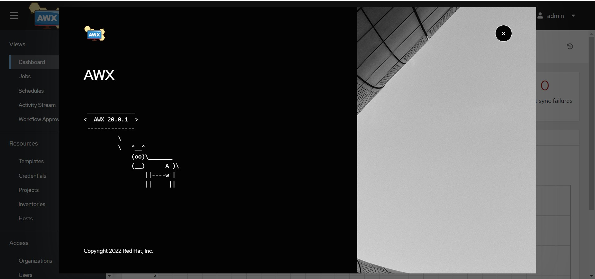
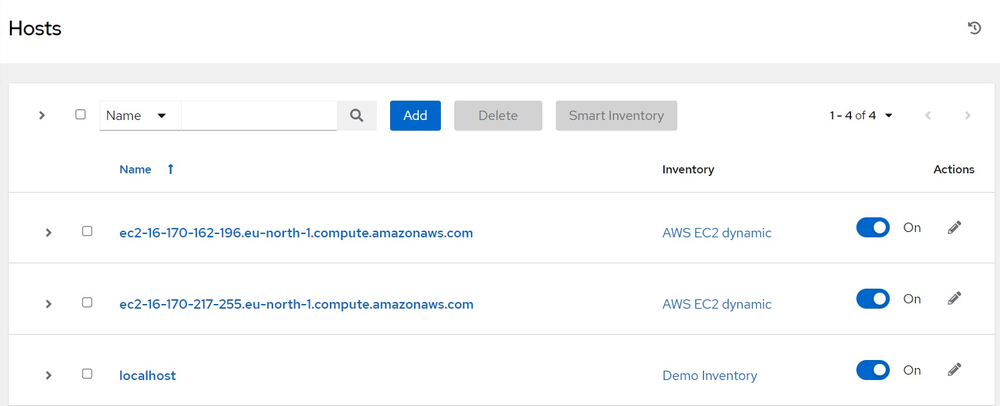
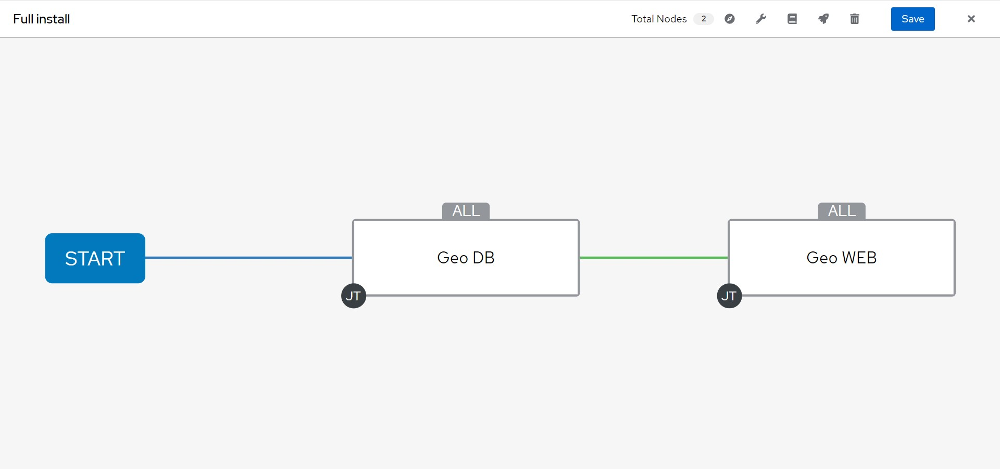
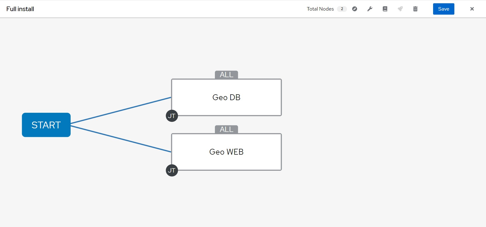

# Ansible AWX  
**Table of Contents**  
- [Ansible AWX](#ansible-awx)
  - [Installation](#installation)
  - [Pre configure](#pre-configure)
    - [Add credentials](#add-credentials)
    - [Add dynamic inventory](#add-dynamic-inventory)
    - [New repository for Project](#new-repository-for-project)
  - [Set AWX with Roles and Templates](#set-awx-with-roles-and-templates)


## Installation  
AWS has official [repo](https://github.com/ansible/awx), where you can find installation guides.  
Starting in version 18.0, the AWX Operator is the preferred way to install AWX. At this moment, the last version on AWX is 20.0.1.  
Official [documentation](https://github.com/ansible/awx-operator#basic-install-on-minikube-beginner-or-testing) describes install on [Minikube](https://minikube.sigs.k8s.io/docs/), but for me it is not working. So we will use installation on K3S.  
Here is nice [guide](https://github.com/kurokobo/awx-on-k3s#awx-on-single-node-k3s).  
And here is the correlation between versions of AWX Operator and AWX  
| AWX Operator | AWX |
| - | - |
| 0.18.0 | 20.0.1 |
| 0.17.0 | 20.0.0 |
| 0.16.1 | 19.5.1 |
| 0.15.0 | 19.5.0 |
| 0.14.0 | 19.4.0 |
| 0.13.0 | 19.3.0 |
| 0.12.0 | 19.2.2 |
| 0.11.0 | 19.2.1 |
| 0.10.0 | 19.2.0 |
| 0.9.0 | 19.1.0 |
| 0.8.0 | 19.0.0 |
| 0.7.0 | 18.0.0 |
| 0.6.0 | 15.0.0 

I've installed latest version


## Pre configure

### Add credentials

Go to Resources/Credentials and add credentials:
- for GitHub (Credentials type - **Source control**)
- for AWS to read data from EC2 (Credentials type - **Amazon Web Services**)
- for EC2 virtual machines, login and ssh key (Credentials type - **Machine**)
> Note, Ubuntu and Amazon Linux have different usernames for login  


### Add dynamic inventory

As in pure ansible, AWX has dynamic inventory capability too. Here is official [guide](https://docs.ansible.com/ansible-tower/latest/html/userguide/inventories.html#amazon-web-services-ec2).

In sources configuration paste following data to `Source variables`
```yml
---
groups:
  web: "'Ubuntu-Web' in tags.Name"
  db: "'Amazon Linux 2 - DB' in tags.Name"
```
Now you can press **Save** and **Sync**. After complition there should be new hosts and groups created 

### New repository for Project

Create new repository in GitHub for AWX to get roles and playbooks.
Then create new folder with following structure

```
.
├── collections
│   └── requirements.yml
├── geo_db.yml
├── geo_web.yml
└── roles
    └── requirements.yml
```

```bash
mkdir awx && cd awx
mkdir collections roles
touch collections/requirements.yml roles/requirements.yml geo_db.yml geo_web.yml
```
Insert following data in yml files  
`collections/requirements.yml`
```yml
---
collections:
  - name: community.general
  - name: community.postgresql
```
`roles/requirements.yml`
```yml
---
roles:
  - name: vladkarok.geo_db
  - name: vladkarok.geo_web
```

`geo_db.yml`
```yml
---
- name: DB
  hosts: db
  become: true
  roles:
    - vladkarok.geo_db
```
`geo_web.yml`
```yml
---
- name: WEB
  hosts: web
  become: true
  roles:
    - vladkarok.geo_web
```
> You can replace values with your role names  

Then add these files to git repo

```bash
git init
git add *
git commit -m "First commit"
git branch -M main
git remote add origin git@github.com:YOUR_NAME/REPO_NAME.git
git push -u origin main
```

## Set AWX with Roles and Templates  

Go to Resources/Projects and create new project. Select Source Control Credential Type - **Git**, paste your ssh link `git@github.com:YOUR_NAME/REPO_NAME.git` to Source Control URL, specify credentials and you may check *Options* - *Clean*, *Update Revision on Launch*  
Then you can Sync project to see if everything OK till now.  
Go to Templates and add **Job Template**  
Specify **Name**, **Job Type-Run**, **Inventory**, **Project**. After that you should be able to choose **playbooks** from drop menu. Specify credentials, check **Privilege Escalation**  
Create Projects for database and web playbooks.

Create **Workflow template**. Besides all nessesary fields, add to variables

```yml
---
email_login: YOUR_EMAIL@LOGIN
email_password: YOUR_EMAIL_PASSWORD
db_user: DATABASE_USERNAME
db_password: DATABASE_USER_PASSWORD
db_name: DATABASE_NAME
```
and check **Enable Concurrent Jobs**

At visualizer you can create jobs and connect them with each other. You may do something like this  or this 

Now you can click on rocket or Launch button.