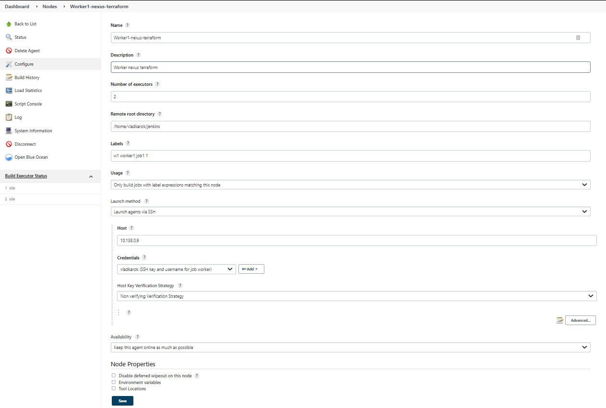
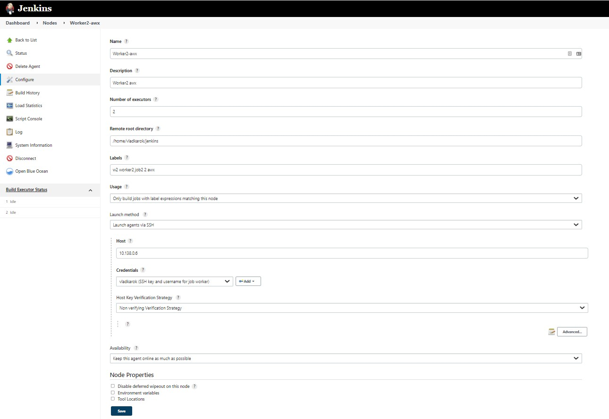
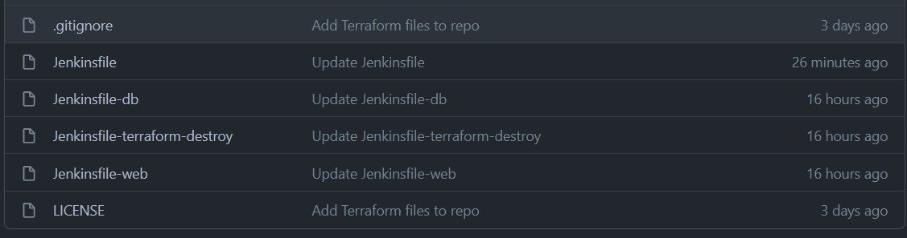
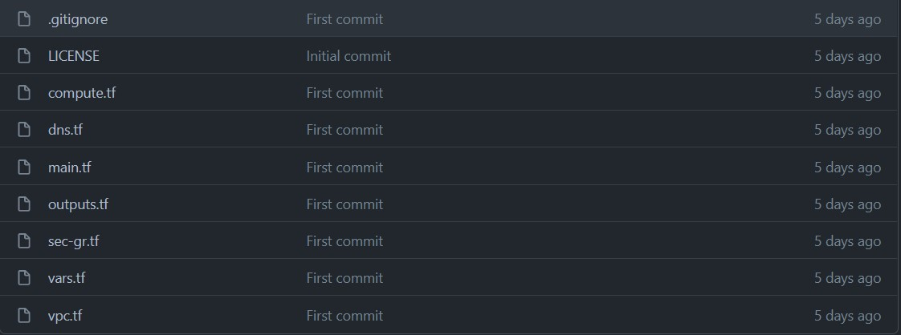
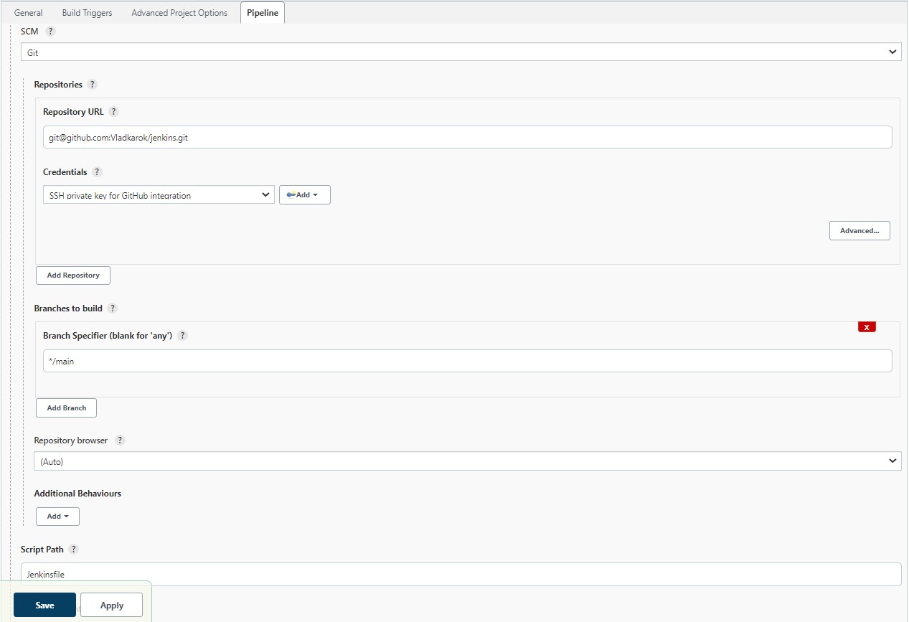

# Jenkins

**Table of Contents**  
- [Jenkins](#jenkins)
  - [Install](#install)
    - [Preparation](#preparation)
    - [Install Jenkins](#install-jenkins)
  - [Configuration](#configuration)
    - [Plugins](#plugins)
    - [Credentials](#credentials)
    - [Manage nodes](#manage-nodes)
    - [Slack integration](#slack-integration)
    - [Jira integration](#jira-integration)
    - [Pipelines](#pipelines)

## Install

### Preparation

Jenkins requires [Java 11](https://www.jenkins.io/doc/administration/requirements/java/).  
[Tutorial](https://www.digitalocean.com/community/tutorials/how-to-install-java-with-apt-on-ubuntu-20-04)

### Install Jenkins
[doc](https://www.jenkins.io/doc/book/installing/linux/#debianubuntu)
```bash
curl -fsSL https://pkg.jenkins.io/debian-stable/jenkins.io.key | sudo tee \
  /usr/share/keyrings/jenkins-keyring.asc > /dev/null
echo deb [signed-by=/usr/share/keyrings/jenkins-keyring.asc] \
  https://pkg.jenkins.io/debian-stable binary/ | sudo tee \
  /etc/apt/sources.list.d/jenkins.list > /dev/null
sudo apt-get update
sudo apt-get install jenkins -y
```

Here is nice [guide](https://www.cloudbooklet.com/how-to-install-jenkins-on-ubuntu-20-04-with-nginx-and-ssl/) too.

## Configuration

### Plugins

Install predefined plugins at first launch.  
After you have to manually install next plugins, like:   

- Ansible Tower Plugin
- Jira plugin
- Terraform Plugin
- Locale plugin
- Slack Notification Plugin
- SSH Agent Plugin
- SSH plugin  
... and maybe soome more 

### Credentials

Go to **Manage Jenkins/Credentials**. With default installed plugin we can store our credentials. It can be secret sctings, secret files, username and passwords, ssh-keys and more.
Here you can create next credentials:  

- ssh usernames and keys for jenkins worker nodes
- credentials for AWX installation
- secret string for *db_user*, *db_password*, *db_name*, *email_login*, *email_password*, *AWS_ACCESS_KEY_ID* and *AWS_SECRET_ACCESS_KEY* for terraform job
-  ssh key for GitHub, Rest-API token for Jira
-  and so on...
  
### Manage nodes

You can perform jobs locally or use nodes. For example I will add node for terraform and awx jobs (you can run awx jobs not only within hots where AWX is installed).  
Go to **Manage Jenkins/Nodes/New Node**  
Specify name and type (default *Permanent agent*), then you can specify number of executors, Remote root directory, Labels (to limit where jobs can run), and lower you specify connection method. I will use SSH. So specify host, choose appropriate credentials, pick "Host Key Verification Strategy" - Non Verifying ... and then press Save. Repeat for second node




### Slack integration

Install and configure [Slack integration](https://jenkins.io/doc/book/installing/linux/#slack-integration)


### Jira integration

Install and configure [Jira integration](https://jenkins.io/doc/book/installing/linux/#jira-integration)

### Pipelines

We will store out code in Gihtub, so we can use Pipeline jobs with pull from SCM method.
I have repository for Terraform code and Jenkins files.





On main dashboard press *New item*, choose name and type - **Pipeline**
At first you can skip all till the end, there in Pipeline section choose **Pipeline script from SCM** 



Pipeline script:

```groovy
pipeline {
    agent { label '1' }

    environment {
        AWS_ACCESS_KEY_ID        = credentials('TERRAFORM_AWS_ACCESS_KEY_ID')
        AWS_SECRET_ACCESS_KEY    = credentials('TERRAFORM_AWS_SECRET_ACCESS_KEY')
    }

    tools {
        terraform 'Terraform'
    }

    stages {
        stage('Git checkout') {
            steps {
                git branch: 'main', credentialsId: 'github-ssh', url: 'YOUR_GITHUB_REPOSITORY'
            }
        }
        stage("Terraform approve"){
            steps {
                script {
                    try {
                        notifyBuild("STARTED")
                        sh "terraform init"
                        sh "terraform validate"
                        sh "terraform apply -auto-approve"
                    } catch (e) {
                        // If there was an exception thrown, the build failed
                        currentBuild.result = "FAILED"
                        jiraComment body: "Job \"${env.JOB_NAME}\" FAILED! ${env.BUILD_URL}", issueKey: 'CDA-21'
                        throw e
                    } finally {
                        // Success or failure, always send notifications
                        notifyBuild(currentBuild.result)
                    }
                }
            }
        }
    }
}

def notifyBuild(String buildStatus = 'STARTED') {
    // build status of null means successful
    buildStatus =  buildStatus ?: 'SUCCESSFUL'

    // Default values
    def colorName = 'RED'
    def colorCode = '#FF0000'
    def subject = "${buildStatus}: Job '${env.JOB_NAME} [${env.BUILD_NUMBER}]'"
    def summary = "${subject} (${env.BUILD_URL}) (${currentBuild.durationString})"

    // Override default values based on build status
    if (buildStatus == 'STARTED') {
        color = 'YELLOW'
        colorCode = '#FFFF00'
    } else if (buildStatus == 'SUCCESSFUL') {
        color = 'GREEN'
        colorCode = '#00FF00'
    } else {
        color = 'RED'
        colorCode = '#FF0000'
    }

    // Send notifications
    slackSend (color: colorCode, message: summary)
}
```

> **Note**:CDA21 is Jira issue key. Your can be different.

