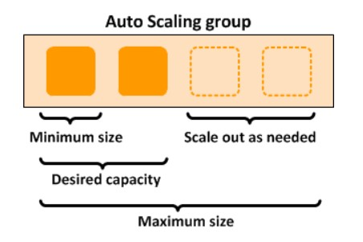

# Amazon Web Services Load Balancer&AutoScaling

**Table of Contents**
- [Amazon Web Services Load Balancer&AutoScaling](#amazon-web-services-load-balancerautoscaling)
  - [Theory](#theory)
    - [Load balancers](#load-balancers)
    - [Auto Scaling group](#auto-scaling-group)
  - [Practice (terraform)](#practice-terraform)
    - [Load balancers](#load-balancers-1)
    - [Auto Scaling group](#auto-scaling-group-1)
  - [Practice (Jenkins)](#practice-jenkins)

## Theory
### Load balancers

Elastic Load Balancing automatically distributes your incoming traffic across multiple targets, such as EC2 instances, containers, and IP addresses, in one or more Availability Zones. It monitors the health of its registered targets, and routes traffic only to the healthy targets. Elastic Load Balancing scales your load balancer as your incoming traffic changes over time. It can automatically scale to the vast majority of workloads.

Elastic Load Balancing supports the following load balancers: **Application Load Balancers**, **Network Load Balancers**, **Gateway Load Balancers**, and **Classic Load Balancers**.  
[Comparison](https://aws.amazon.com/elasticloadbalancing/features/#Product_comparisons) of the different types of load balancers.  
**Classic Load Balancer** is using when you have an existing application running in the EC2-Classic network, but AWS will be retiring the EC2-Classic network on August 15, 2022, so we will ommit using it.  
**Network Load Balancers**  
A Network Load Balancer functions at the fourth layer of the Open Systems Interconnection (OSI) model. It can handle millions of requests per second. After the load balancer receives a connection request, it selects a target from the target group for the default rule. It attempts to open a TCP connection to the selected target on the port specified in the listener configuration.

[More info](https://docs.aws.amazon.com/elasticloadbalancing/latest/network/introduction.html)  

**Gateway Load Balancers**  
Gateway Load Balancers enable you to deploy, scale, and manage virtual appliances, such as firewalls, intrusion detection and prevention systems, and deep packet inspection systems. It combines a transparent network gateway (that is, a single entry and exit point for all traffic) and distributes traffic while scaling your virtual appliances with the demand.

[More info](https://docs.aws.amazon.com/elasticloadbalancing/latest/gateway/introduction.html)

**Application Load Balancers**  
An Application Load Balancer functions at the application layer, the seventh layer of the Open Systems Interconnection (OSI) model. After the load balancer receives a request, it evaluates the listener rules in priority order to determine which rule to apply, and then selects a target from the target group for the rule action.


[More info](https://docs.aws.amazon.com/elasticloadbalancing/latest/application/introduction.html)

### Auto Scaling group

An Auto Scaling group is a collection of Amazon EC2 instances that are treated as a logical unit. You configure settings for a group and its instances as well as define the group’s minimum, maximum, and desired capacity. Setting different minimum and maximum capacity values forms the bounds of the group, which allows the group to scale as the load on your application spikes higher or lower, based on demand. To scale the Auto Scaling group, you can either make manual adjustments to the desired capacity or let Amazon EC2 Auto Scaling automatically add and remove capacity to meet changes in demand.  
  
[More info](https://docs.aws.amazon.com/autoscaling/ec2/userguide/what-is-amazon-as-auto-scaling.html)  
[Getting started tutorial](https://docs.aws.amazon.com/autoscaling/ec2/userguide/GettingStartedTutorial.html)

## Practice (terraform)
Our Application should be looking like this:


### Load balancers

First, we need to create a **Target Group** for Load Balancer. It can be empty for now.

```hcl
resource "aws_lb_target_group" "geo_web" {
  name        = "geo-web"
  port        = 8080
  protocol    = "HTTP"
  target_type = "instance"
  vpc_id      = aws_vpc.main.id
  health_check {
    path                = "/citizen/"
    interval            = 60
    port                = 8080
    protocol            = "HTTP"
    timeout             = 5
    healthy_threshold   = 3
    unhealthy_threshold = 3
    matcher             = "200-299"
  }
}
```

Then we can create a **Load Balancer**.

```hcl
resource "aws_lb" "geo_web" {
  name               = "geo-web"
  internal           = false
  load_balancer_type = "application"
  security_groups    = [aws_security_group.allow_web.id]
  subnets            = [for subnet in aws_subnet.public_subnets : subnet.id]

  enable_deletion_protection = false

  tags = {
    Environment = "dev"
    Name        = "geo-web"
  }
}
```

And **Load Balancer Listener**.

```hcl
resource "aws_lb_listener" "front_end" {
  load_balancer_arn = aws_lb.geo_web.arn
  port              = "80"
  protocol          = "HTTP"

  default_action {
    type             = "forward"
    target_group_arn = aws_lb_target_group.geo_web.arn
  }
}
```
### Auto Scaling group

Then we can create a **Auto Scaling Group**.


Here we can proceed with creating **Template launch configuration**

```hcl
resource "aws_launch_configuration" "geo_web" {
  name_prefix                 = "geo-web"
  image_id                    = data.aws_ami.ubuntu_latest.id
  instance_type               = var.instance_type
  security_groups             = [aws_security_group.allow_web.id]
  key_name                    = var.ssh_key_name
  enable_monitoring           = false
  associate_public_ip_address = true
  user_data                   = <<EOF
#!/bin/bash

## Update the system
sudo apt-get update > /dev/null 2>&1

## Install Java 11
sudo apt-get install openjdk-11-jdk -y > /dev/null 2>&1

## Add user Tomcat
sudo useradd -m -U -d /opt/tomcat -s /bin/false tomcat > /dev/null 2>&1 || true

## Download Tomcat
t_version="9.0.62"
t_link="https://www-eu.apache.org/dist/tomcat/tomcat-9/v$t_version/bin/apache-tomcat-$t_version.tar.gz"
wget $t_link -P /tmp > /dev/null 2>&1

## Extract Tomcat
sudo tar -xf /tmp/apache-tomcat-$t_version.tar.gz -C /opt/tomcat/ > /dev/null 2>&1
sudo rm /tmp/apache-tomcat-$t_version.tar.gz

## Create symbolic link
sudo ln -s /opt/tomcat/apache-tomcat-$t_version /opt/tomcat/latest > /dev/null 2>&1 || true
sudo chown -R tomcat: /opt/tomcat

sudo sh -c 'chmod +x /opt/tomcat/latest/bin/*.sh'

## Create systemd service
sudo sh -c 'cat > /etc/systemd/system/tomcat.service' << SOF
[Unit]
Description=Apache Tomcat Web Application Container
After=network.target

[Service]
Type=forking

User=tomcat
Group=tomcat

Environment="JAVA_HOME=/usr/lib/jvm/java-11-openjdk-amd64"
Environment="JAVA_OPTS=-Djava.security.egd=file:///dev/urandom -Djava.awt.headless=true"

Environment="CATALINA_BASE=/opt/tomcat/latest"
Environment="CATALINA_HOME=/opt/tomcat/latest"
Environment="CATALINA_PID=/opt/tomcat/latest/temp/tomcat.pid"
Environment="CATALINA_OPTS=-Xms512M -Xmx1024M -server -XX:+UseParallelGC"

ExecStart=/opt/tomcat/latest/bin/startup.sh
ExecStop=/opt/tomcat/latest/bin/shutdown.sh

[Install]
WantedBy=multi-user.target
SOF

sudo systemctl daemon-reload
sudo systemctl enable --now tomcat

## Downloading .war file

curl -L \
-u ${var.nexus_user_login}:${var.nexus_user_pass} \
--output citizen.war  \
"http://35.247.90.117:8081/service/rest/v1/search/assets/download?sort=version&direction=desc&repository=maven-snapshots&maven.groupId=com.softserveinc&maven.artifactId=geo-citizen&maven.baseVersion=1.0.5-SNAPSHOT&maven.extension=war" > /dev/null 2>&1 || true

## Move .war to tomcat
sudo mv citizen.war /opt/tomcat/latest/webapps/citizen.war
EOF
  lifecycle {
    create_before_destroy = true
  }
}
```

It contains script ins user_data which will be executed on instance creation.

Then we can create **Auto Scaling Group**.

```hcl
resource "aws_autoscaling_group" "geo_web" {
  #  availability_zones        = [data.aws_availability_zones.available.names[0], data.aws_availability_zones.available.names[1]]
  name                      = "geo-web"
  desired_capacity          = var.desired_capacity
  max_size                  = var.max_size
  min_size                  = var.min_size
  health_check_grace_period = 90
  health_check_type         = "ELB"
  force_delete              = true
  termination_policies      = ["OldestInstance"]
  launch_configuration      = aws_launch_configuration.geo_web.name
  vpc_zone_identifier       = [aws_subnet.public_subnets[0].id, aws_subnet.public_subnets[1].id]
  target_group_arns = [
    aws_lb_target_group.geo_web.arn
  ]
  lifecycle {
    ignore_changes = [
      desired_capacity,
      target_group_arns
    ]
  }
  tag {
    key                 = "Name"
    value               = "Ubuntu-Web"
    propagate_at_launch = true
  }
}
```

And **Auto Scaling Policy**.

```hcl
resource "aws_autoscaling_policy" "geo_web" {
  name                   = "geo-web"
  adjustment_type        = "ChangeInCapacity"
  autoscaling_group_name = aws_autoscaling_group.geo_web.name
  policy_type            = "TargetTrackingScaling"
  target_tracking_configuration {
    predefined_metric_specification {
      predefined_metric_type = "ASGAverageCPUUtilization"
    }
    target_value = 50.0
  }
}
```

That's all. Also you have to add new items to *vars.tf*

```hcl
variable "desired_capacity" {
  type        = number
  description = "Desired capacity"
  default     = 2
}

variable "min_size" {
  type        = number
  description = "Minimum capacity"
  default     = 1
}
variable "max_size" {
  type        = number
  description = "Maximum capacity"
  default     = 5
}

variable "nexus_user_login" {
  type      = string
  sensitive = true
}

variable "nexus_user_pass" {
  type      = string
  sensitive = true
}
```
Now you can pass these variables to Terraform.

```bash
terraform plan -var "nexus_user_login=YOUR_LOGIN" -var "nexus_user_pass=YOUR_PASSWORD"
```

## Practice (Jenkins)

As we configuring our web via *user_data*, but Database via AWX, we have to specify what we want to do first, second, third in terraform configuration. There is `-target="RESOURCE_NAME.SPECIAL_NAME"` option in Terraform.

So Jenkinsfile should be like this: 

```groovy
pipeline {
    agent { label 'terraform' }

    environment {
        db_user                  = credentials('db_user')
        db_password              = credentials('db_password')
        db_name                  = credentials('db_name')
        AWS_ACCESS_KEY_ID        = credentials('TERRAFORM_AWS_ACCESS_KEY_ID')
        AWS_SECRET_ACCESS_KEY    = credentials('TERRAFORM_AWS_SECRET_ACCESS_KEY')
    }

    tools {
        terraform 'Terraform'
    }

    stages {
        stage('Git checkout') {
            steps {
                git branch: 'terraform-aws-lb', credentialsId: 'github-ssh', url: 'git@github.com:Vladkarok/Geocit134.git'
            }
        }
        stage("Terraform apply db"){
            steps {
                script {
                    try {
                        notifyBuild("STARTED")
                        withCredentials([usernamePassword(credentialsId: 'geo-nexus-user', usernameVariable: 'nexus_user_login', passwordVariable: 'nexus_user_pass')]) {
                        sh 'terraform init -no-color'
                        sh 'terraform validate -no-color'
                        sh 'terraform apply -auto-approve -no-color -var "nexus_user_login=${nexus_user_login}" -var "nexus_user_pass=${nexus_user_pass}" -target="aws_security_group.allow_db" -target="aws_instance.Amazon_Linux_DB" -target="aws_route53_record.db_domain" -target="aws_vpc.main" -target="aws_internet_gateway.main" -target="aws_subnet.public_subnets" -target="aws_route_table.public_subnets" -target="aws_route_table_association.public_routes"'
                        }
                    } catch (err) {
                        echo "Caught: ${err}"
                        // If there was an exception thrown, the build failed
                        currentBuild.result = "FAILED"
                        jiraComment body: "Job \"${env.JOB_NAME}\" FAILED! ${env.BUILD_URL}", issueKey: 'CDA-21'
                        throw err
                    } finally {
                        // Success or failure, always send notifications
                        sh 'echo "Terraform apply db"'
                    }
                }
            }
        }

        stage("AWX DB configure"){
            steps {
                script {
                    try {
                        ansibleTower extraVars: '''db_user: $db_user
db_password: $db_password
db_name: $db_name''', jobTemplate: 'Geo DB', jobType: 'run', throwExceptionWhenFail: false, towerCredentialsId: 'awx-cred', towerLogLevel: 'full', towerServer: 'AWX'
                    } catch (err) {
                        echo "Caught: ${err}"
                        // If there was an exception thrown, the build failed
                        currentBuild.result = "FAILED"
                        jiraComment body: "Job \"${env.JOB_NAME}\" FAILED! ${env.BUILD_URL}", issueKey: 'CDA-21'
                        throw err                        
                    } finally {
                        // Success or failure, always send notifications
                        sh 'echo "AWX DB configure"'
                    }
                }
            }
        }

        stage("Terraform apply all"){
            steps {
                script {
                    try {
                        withCredentials([usernamePassword(credentialsId: 'geo-nexus-user', usernameVariable: 'nexus_user_login', passwordVariable: 'nexus_user_pass')]) {
                            sh 'terraform apply -auto-approve -no-color -var "nexus_user_login=${nexus_user_login}" -var "nexus_user_pass=${nexus_user_pass}"'
                        }
                    } catch (err) {
                        echo "Caught: ${err}"
                        // If there was an exception thrown, the build failed
                        currentBuild.result = "FAILED"
                        jiraComment body: "Job \"${env.JOB_NAME}\" FAILED! ${env.BUILD_URL}", issueKey: 'CDA-21'
                        throw err                        
                    } finally {
                        // Success or failure, always send notifications
                        notifyBuild(currentBuild.result)
                    }
                }
            }
        }

    }
}

def notifyBuild(String buildStatus = 'STARTED') {
    // build status of null means successful
    buildStatus =  buildStatus ?: 'SUCCESSFUL'

    // Default values
    def colorName = 'RED'
    def colorCode = '#FF0000'
    def subject = "${buildStatus}: Job '${env.JOB_NAME} [${env.BUILD_NUMBER}]'"
    def summary = "${subject} (${env.BUILD_URL}) (${currentBuild.durationString})"

    // Override default values based on build status
    if (buildStatus == 'STARTED') {
        color = 'YELLOW'
        colorCode = '#FFFF00'
    } else if (buildStatus == 'SUCCESSFUL') {
        color = 'GREEN'
        colorCode = '#00FF00'
    } else {
        color = 'RED'
        colorCode = '#FF0000'
    }

    // Send notifications
    slackSend (color: colorCode, message: summary)
}
```