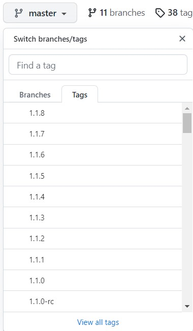
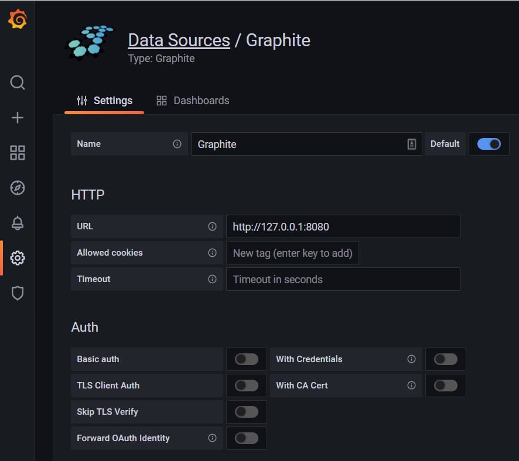

# Graphite
**Table of Contents**
- [Graphite](#graphite)
  - [Graphite architecture](#graphite-architecture)
  - [Installation steps](#installation-steps)
  - [Configuring Grafana Datasources](#configuring-grafana-datasources)
  
## Graphite architecture

[Documentation](https://graphite.readthedocs.io/en/latest/)

Architecture:


Graphite consists of 3 software components:

1. **carbon** - a Twisted daemon that listens for time-series data
2. **whisper** - a simple database library for storing time-series data (similar in design to RRD)
3. **graphite webapp** - A Django webapp that renders graphs on-demand using Cairo

The installation of Graphite can be done in these ways:
- in docker
- from source code
- via pip
- in virtualenv
- via Synthesize script
  
We will install from source code.

## Installation steps

Besides Graphite has own webapp and datastore, we will also install Nginx for web proxy and PostreSQL for database.

The installation is performing on fresh Ubuntu 20.04 LTS server.

**Install prerequisites**:

```bash
sudo apt -y install python3-dev python3-pip libcairo2-dev libffi-dev build-essential
```
Set [PythonPath](https://docs.python.org/3/using/cmdline.html#envvar-PYTHONPATH) to augment the default search path for module files.

```bash
export PYTHONPATH="/opt/graphite/lib/:/opt/graphite/webapp/"
```
**Install the data storage engine**.

```bash
sudo -H pip3 install --no-binary=:all: https://github.com/graphite-project/whisper/tarball/1.1.x
```

**Install Carbon data-caching daemon**.

```bash
sudo -H pip3 install --no-binary=:all: https://github.com/graphite-project/carbon/tarball/1.1.x
```

**Install the web-based visualization frontend**.

```bash
sudo -H pip3 install --no-binary=:all: https://github.com/graphite-project/graphite-web/tarball/1.1.x
```
> **Note:** the **1.1.x** version may change from time to time, it is basically a tag names, and by selecting **\*** just picks the last available.The tags and branches names you can find there:




**Install and Configure Database**  
Graphite-web is a Django Python application which needs to store its data somewhere, even if the Graphite data is handled by Carbon and the whisper library.  
By default, it is configured for using SQLite3, but it’s preferable to use PostgreSQL.

```bash
sudo apt-get install -y postgresql libpq-dev python3-psycopg2
```

The next step is to create a database with a user and password.

```bash
sudo -u postgres psql
```
```postgres
CREATE USER graphite_db_user WITH PASSWORD '$SECURE_PASS';
CREATE DATABASE graphite_db WITH OWNER graphite_db_user;
CREATE USER grafana_db_user WITH PASSWORD '$SECURE_PASS_2';
CREATE DATABASE grafana_db WITH OWNER grafana_db_user;
\q
```
> **Note**: We created graphite as well as grafana user and database. It will be neede in future, just note this parameters. And $SECURE_PASS and $SECURE_PASS_2 are secure passwords for graphite and grafana databases.

**Graphite Web Configuration**  
Graphite-web uses the convention of importing a [local_settings.py](https://graphite.readthedocs.io/en/latest/config-local-settings.html) file from the web app settings.py module - Graphite-web’s runtime configuration loads from here. We must copy an example template before adding our desired configuration to the web app.

```bash
cd /opt/graphite/webapp/graphite
sudo cp local_settings.py.example local_settings.py
sudo nano local_settings.py
```

Uncomment and edit the following attributes **SECRET_KEY**, **TIME_ZONE**, **USE_REMOTE_USER_AUTHENTICATION** and **DATABASES** sections as outlined below:

```bash
SECRET_KEY = '$SECURE_PASS'
```

```bash
SECRET_KEY = '$SECURE_PASS'
```

```bash
TIME_ZONE = 'Europe/Kiev'
```

```bash
USE_REMOTE_USER_AUTHENTICATION = True
```

```bash
DATABASES = {
    'default': {
        'NAME': 'graphite_db',
        'ENGINE': 'django.db.backends.postgresql_psycopg2',
        'USER': 'graphite_db_user',
        'PASSWORD': '$SECURE_PASS',
        'HOST': '127.0.0.1',
        'PORT': ''
    }
}
```

**Graphite Schema**  
It is necessary to set up an initial Graphite [schema](http://graphite.readthedocs.io/en/latest/config-database-setup.html) with the following command.

```bash
sudo -H PYTHONPATH=/opt/graphite/webapp django-admin migrate --settings=graphite.settings --run-syncdb
```

Output:
```bash
Operations to perform:
  Synchronize unmigrated apps: browser, composer, functions, messages, metrics, render, staticfiles, whitelist
  Apply all migrations: account, admin, auth, contenttypes, dashboard, events, sessions, tagging, tags, url_shortener
Synchronizing apps without migrations:
  Creating tables...
    Running deferred SQL...
Running migrations:
  Applying contenttypes.0001_initial... OK
  Applying auth.0001_initial... OK
  Applying account.0001_initial... OK
  Applying admin.0001_initial... OK
  Applying admin.0002_logentry_remove_auto_add... OK
  Applying admin.0003_logentry_add_action_flag_choices... OK
  Applying contenttypes.0002_remove_content_type_name... OK
  Applying auth.0002_alter_permission_name_max_length... OK
  Applying auth.0003_alter_user_email_max_length... OK
  Applying auth.0004_alter_user_username_opts... OK
  Applying auth.0005_alter_user_last_login_null... OK
  Applying auth.0006_require_contenttypes_0002... OK
  Applying auth.0007_alter_validators_add_error_messages... OK
  Applying auth.0008_alter_user_username_max_length... OK
  Applying auth.0009_alter_user_last_name_max_length... OK
  Applying auth.0010_alter_group_name_max_length... OK
  Applying auth.0011_update_proxy_permissions... OK
  Applying dashboard.0001_initial... OK
  Applying events.0001_initial... OK
  Applying sessions.0001_initial... OK
  Applying tagging.0001_initial... OK
  Applying tagging.0002_on_delete... OK
  Applying tags.0001_initial... OK
  Applying url_shortener.0001_initial... OK
```

At this point, the database is empty, so we need a user that has complete access over the administration system. The Django-admin script outlined below; with the “createsuperuser” arg, will prompt you for a username, e-mail, and password; creating an admin user for managing other users on the web front end.

```bash
sudo -H PYTHONPATH=/opt/graphite/webapp django-admin createsuperuser --settings=graphite.settings
```
Output:
```
Username (leave blank to use 'root'): some_user
Email address: YOUR@EMAIL
Password:
Password (again):
Superuser created successfully.
```

**Static Content**  
`/opt/graphite/static` is the default location for Graphite-web’s static content. One must manually populate the directory with the following command:

```bash
sudo -H PYTHONPATH=/opt/graphite/webapp django-admin collectstatic --noinput --settings=graphite.settings
```
Output:
```
478 static files copied to '/opt/graphite/static'.
```

**Carbon Configuration**  
Next, there are two configuration files that carbon uses to control its cache and aggregation abilities, as well as the output storage format. We must copy the example configuration files as a template for carbon.conf and storage-schemas.conf.

```bash
sudo cp /opt/graphite/conf/carbon.conf.example /opt/graphite/conf/carbon.conf
sudo cp /opt/graphite/conf/storage-schemas.conf.example /opt/graphite/conf/storage-schemas.conf
```

Add the following to **storage-schemas.conf** to define retention and downsampling requirements; as recommended by [StatsD](https://github.com/statsd/statsd/blob/master/docs/graphite.md#storage-schemas).

```bash
sudo nano /opt/graphite/conf/storage-schemas.conf
```

```
[stats]
pattern = ^stats.*
retentions = 10s:6h,1m:6d,10m:1800d
```

The above translates for all metrics starting with 'stats' (i.e. all metrics sent by StatsD), capture:

- Six hours of 10-second data (what we consider "near-real-time")
- Six days of 1-minute data
- Five years of 10-minute data  

The recommendations also outline aggregation specifications to ensure matching patterns; preventing data being corrupted or discarded when downsampled.  
Edit the **conf/storage-aggregation.conf** file to mimic the following.

```bash
sudo cp /opt/graphite/conf/storage-aggregation.conf.example /opt/graphite/conf/storage-aggregation.conf
sudo nano /opt/graphite/conf/storage-aggregation.conf
```

```
[min]
pattern = \.lower$
xFilesFactor = 0.1
aggregationMethod = min

[max]
pattern = \.upper(_\d+)?$
xFilesFactor = 0.1
aggregationMethod = max

[sum]
pattern = \.sum$
xFilesFactor = 0
aggregationMethod = sum

[count]
pattern = \.count$
xFilesFactor = 0
aggregationMethod = sum

[count_legacy]
pattern = ^stats_counts.*
xFilesFactor = 0
aggregationMethod = sum

[default_average]
pattern = .*
xFilesFactor = 0.3
aggregationMethod = average
```

Metrics ending with **.lower** or **.upper**, only the minimum and the maximum value retain. See [StatsD](https://github.com/statsd/statsd/blob/master/docs/graphite.md#storage-schemas) for more details.  

At this point, we can do a quick test to ensure the setup is correct. Run the web interface under the Django development server with the following commands.  

```bash
cd /opt/graphite 
sudo PYTHONPATH=`pwd`/whisper ./bin/run-graphite-devel-server.py --libs=`pwd`/webapp/ /opt/graphite/
```

By default, the server will listen on port 8080, point your web browser to http://127.0.0.1.

The graphite interface should appear. If not the debug mode configuration should provide enough information; if not tail the latest process log.

```bash
tail -f /opt/graphite/storage/log/webapp/*.log
```

**StatsD**

Applications use a collector client to feed device metrics upstream to a Graphite server; typically using [StatsD](https://www.metricfire.com/blog/statsd-what-is-it-and-how-to-monitor-it/) or [CollectD](https://www.metricfire.com/blog/collectd-plugins/). StatsD is an event counter/aggregation service; listening on a UDP port for incoming metrics data it periodically sends aggregated events upstream to a back-end such as Graphite.  

Today, [StatsD](https://github.com/statsd/statsd) refers to the original protocol written at Etsy and to the myriad of services that now implement this protocol. 

StatsD requires Node; to install, use the following commands.

```bash
curl -L -s https://deb.nodesource.com/setup_14.x | sudo bash
sudo apt install -y nodejs
sudo ln -s /usr/bin/node /usr/local/bin/node

```

Clone StatsD from Etsy repository.

```
sudo git clone https://github.com/etsy/statsd.git /opt/statsd
```

Add the following configuration for Graphite integration.  

``` bash
sudo cp /opt/statsd/exampleConfig.js /opt/statsd/localConfig.js
sudo nano /opt/statsd/localConfig.js
```
Content:
```
{
   graphitePort: 2003,
   graphiteHost: "127.0.0.1",
   port: 8125,
   backends: [ "./backends/graphite" ]
}
```

**Supervisord**

We will use [supervisor](http://supervisord.org/) to manage the Carbon, StatsD and Gunicorn processes. A [configuration](http://supervisord.org/configuration.html#configuration-file) file is required for each process outlined below.

```bash
sudo apt install -y supervisor
```

_**StatsD**_
```bash
sudo nano /etc/supervisor/conf.d/statsd.conf
```
Content:
```
[program:statd]

command=/usr/local/bin/node /opt/statsd/stats.js /opt/statsd/localConfig.js

process_name=%(program_name)s

autostart=true

autorestart=true

stopsignal=QUIT
```

_**Gunicorn**_
```bash
sudo nano /etc/supervisor/conf.d/gunicorn.conf
```
Content:
```
[program:gunicorn]

command = gunicorn wsgi:application -w 2 --pythonpath=/opt/graphite/webapp/graphite --bind 127.0.0.1:8080


directory = /opt/graphite/webapp/

autostart=true

autorestart=true

redirect_stderr = true
```

_**Carbon.**_
```bash
sudo nano /etc/supervisor/conf.d/carbon.conf
```
Content:
```
[program:carbon]

command = /opt/graphite/bin/carbon-cache.py --debug start

autostart=true

autorestart=true

redirect_stderr = true
```

And before we can run Supervisord, we need to install gunicorn and nginx.

**Nginx**

We will now expose the web application using [Nginx](https://graphite.readthedocs.io/en/latest/config-webapp.html#configure-nginx) which will proxy requests for Gunicorn, which in turn listens locally on port 8080 serving the web app (Django application).

```bash
sudo apt install -y gunicorn nginx
sudo ln -s /usr/bin/gunicorn /opt/graphite/bin/gunicorn
```
Create Nginx log files and add the correct permissions.

```bash
sudo touch /var/log/nginx/graphite.access.log
sudo touch /var/log/nginx/graphite.error.log
sudo chmod 640 /var/log/nginx/graphite.*
sudo chown www-data:www-data /var/log/nginx/graphite.*
sudo touch /var/log/nginx/grafana.access.log
sudo touch /var/log/nginx/grafana.error.log
sudo chmod 640 /var/log/nginx/grafana.*
sudo chown www-data:www-data /var/log/nginx/grafana.*
```

Create a configuration file called `/etc/nginx/sites-available/graphite.yourdomain.com` and add the following content. Change the HOSTNAME to match your server name.

```bash
sudo nano /etc/nginx/sites-available/graphite.vladkarok.ml
```
Content:
```
upstream graphite {
    server 127.0.0.1:8080 fail_timeout=0;
}

server {
    listen 80;

    server_name graphite.vladkarok.ml www.graphite.vladkarok.ml;

    root /opt/graphite/webapp;

    access_log /var/log/nginx/graphite.access.log;
    error_log  /var/log/nginx/graphite.error.log;

    location = /favicon.ico {
        return 204;
    }

    # serve static content from the "content" directory
    location /static {
        alias /opt/graphite/webapp/content;
        expires max;
    }

    location / {
        try_files $uri @graphite;
    }

    location @graphite {
        proxy_pass_header Server;
        proxy_set_header Host $http_host;
        proxy_redirect off;
        proxy_set_header X-Real-IP $remote_addr;
        proxy_set_header X-Scheme $scheme;
        proxy_connect_timeout 10;
        proxy_read_timeout 10;
        proxy_pass http://graphite;
    }
}
```
```bash
sudo nano /etc/nginx/sites-available/grafana.vladkarok.ml
```
Content:
```
map $http_upgrade $connection_upgrade {
  default upgrade;
  '' close;
}

server {
  listen 80;
  server_name grafana.vladkarok.ml www.grafana.vladkarok.ml;
  root /usr/share/nginx/html;
  index index.html index.htm;

  access_log /var/log/nginx/grafana.access.log;
  error_log  /var/log/nginx/grafana.error.log;

  location / {
    proxy_set_header Host $http_host;
    proxy_pass http://localhost:3000/;
  }

  # Proxy Grafana Live WebSocket connections.
  location /api/live {
    rewrite  ^/(.*)  /$1 break;
    proxy_http_version 1.1;
    proxy_set_header Upgrade $http_upgrade;
    proxy_set_header Connection $connection_upgrade;
    proxy_set_header Host $http_host;
    proxy_pass http://localhost:3000/;
  }
}
```


We need to enable the server block files by creating symbolic links from these files to the sites-enabled directory, which Nginx reads from during startup.

```bash
sudo ln -s /etc/nginx/sites-available/graphite.vladkarok.ml /etc/nginx/sites-enabled
 
sudo rm -f /etc/nginx/sites-enabled/default
```
> **Note:** You have to change the server_name to match your server name as well as file name.

Then validate Nginx configuration.
```
sudo nginx -t 
```
Output:
```
nginx: the configuration file /etc/nginx/nginx.conf syntax is ok
nginx: configuration file /etc/nginx/nginx.conf test is successful
```
Finally, restart Nginx service.
```bash
sudo systemctl restart nginx
```

**Supervisord continue**

From here we can proceed with Surepvisord.  
Restart supervisor for the new configuration to be reloaded.
```bash
sudo systemctl restart supervisor
sudo systemctl enable supervisor
```

The following command will reveal if the processes are running successfully or not.
```bash
sudo supervisorctl 
```
Output:
```
carbon                           RUNNING   pid 23833, uptime 0:04:12
gunicorn                         RUNNING   pid 23834, uptime 0:04:12
statd                            RUNNING   pid 23989, uptime 0:04:12
```

If there is an error you can debug with the following.
```bash
systemctl status supervisor 
tail -f /var/log/supervisor/supervisord.log
```
Or `tail -f /var/log/supervisor/`(carbon/statd/gunicorn-related logs).

**Grafana**

```bash
sudo apt-get install -y apt-transport-https
sudo apt-get install -y software-properties-common wget
wget -q -O - https://packages.grafana.com/gpg.key | sudo apt-key add -
echo "deb https://packages.grafana.com/enterprise/deb stable main" | sudo tee -a /etc/apt/sources.list.d/grafana.list
sudo apt-get update
sudo apt-get install -y grafana-enterprise
```
Configure Grafana to use PostgreSQL for database:

```bash
sudo nano /etc/grafana/grafana.ini
```
Content:
```
[database]
type = postgres
host = 127.0.0.1:5432
name = grafana_db
user = grafana_db_user
password = <db_password>

[server]
protocol = http
http_addr = 127.0.0.1
http_port = 3000
domain = localhost
enforce_domain = false
root_url = %(protocol)s://%(domain)s/

[security]
admin_user = admin
admin_password = <password>
secret_key = some_long_secret_key
```
> **Note:** You have to change the password to match your password.


To start the service and verify that the service has started:
```bash
sudo systemctl daemon-reload
sudo systemctl start grafana-server
sudo systemctl status grafana-server
```

Configure the Grafana server to start at boot:
```bash
sudo systemctl enable grafana-server.service
```

**SSL**

```bash
sudo apt install certbot python3-certbot-nginx
sudo certbot --nginx -d graphite.vladkarok.ml -d www.graphite.vladkarok.ml
sudo certbot --nginx -d grafana.vladkarok.ml -d www.grafana.vladkarok.ml
```
> **Note:** You have to change the domain names to match your domain names and have to appropriately configure the A DNS records.

## Configuring Grafana Datasources

Go to “Configuration” and choose “Data Sources”. Then click “Add data source”. By default, Grafana supports Graphite, Prometheus, Open TSDB, and several other aggregators. If the standard plugins are not enough you can download the one you need.  
Choose “Graphite” and configure data source settings:


Click on `Save & test` and you should get a success message.

