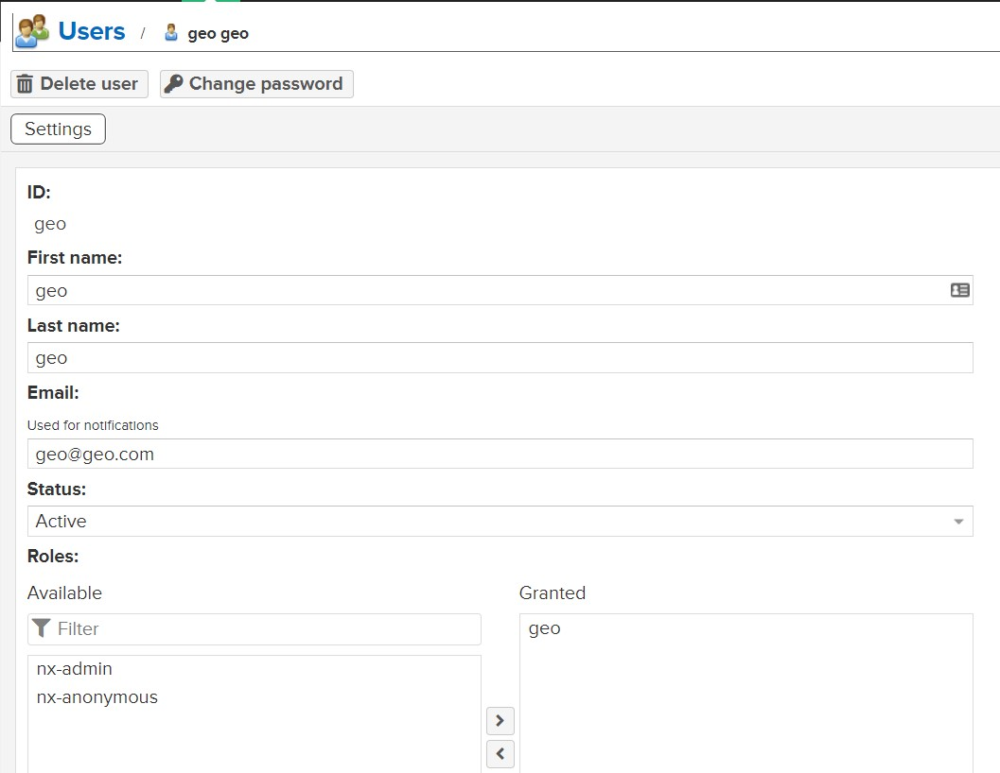

# Nexus Repository OSS

**Table of contents**  
- [Nexus Repository OSS](#nexus-repository-oss)
  - [Installation](#installation)
  - [Configuration](#configuration)
    - [Nexus](#nexus)
    - [Jenkins](#jenkins)
  - [ALTERNATIVE Installation (Nexus+Nginx+Certbot(Let's Encrypt) on Docker)](#alternative-installation-nexusnginxcertbotlets-encrypt-on-docker)


## Installation
Nexus Repository OSS requires Java 8, but I want to install it on the same machine as the Jenkins node running, and Jenkins Node requires Java 11 (or better to be the same as the Jenkins server has). So we will use **docker** to run the installation (on Ubuntu 20.04).
Also you should mention [system requirements](https://help.sonatype.com/repomanager3/product-information/system-requirements) for Nexus Repository OSS.

- Install [Docker](https://docs.docker.com/engine/install/ubuntu/)
- Install [Docker Compose](https://docs.docker.com/compose/install/)
- Follow [Post-installation steps for Linux](https://docs.docker.com/compose/install/#post-installation-steps-for-linux)
- Create directory for Nexus Repository OSS and navigate to it
```bash
mkdir nexus-repository-oss
cd nexus-repository-oss
```
- Create docker-compose.yml file

```bash
vim docker-compose.yml
```
Add the following content to the file

```yaml
version: "3"
services:
  nexus3:
    restart: always
    image: sonatype/nexus3
    volumes:
    - ./nexus-data:/nexus-data
    ports:
    - 8081:8081
    ulimits:
        nofile:
            soft: 65536
            hard: 65536
```
If you want to adjust something, you can always refer to [this](https://github.com/compose-spec/compose-spec/blob/master/spec.md) for the details.  
Here you can run docker-compose command ```docker-compose up -d``` now and face with the following error:
 ```
Cannot create directory nexus-data: Permission denied
 ```
Here just adjust directory ownership:
```bash
chown -R 200:200 nexus-data
```
Now you can run command ```docker-compose up -d``` to start the service.

Open the browser and navigate to http://YOUR_IP:8081 to see the service. 
> **Note**: Default user is `admin` and the uniquely generated password can be found in the `admin.password` file inside the volume.

So Nexus is installed and running.


## Configuration

### Nexus

Create role with permissions for maven-releases and maven-snapshots repositories. Create user and attach the role to the user.




### Jenkins

In Jenkins create credentials (username and password) for Nexus Repository OSS.

Install plugins:
- Nexus Artifact Uploader
- Nexus Platform Plugin
- Maven

Configure Maven plugin

[example video](https://www.youtube.com/watch?v=V-VFrYF_Z1Y)


Then you can create pipeline jobs to upload artifacts to Nexus Repository OSS.

```groovy
pipeline {

    agent {
        label 'nexus'
    }

    environment {
        db_user        = credentials('db_user')
        db_password    = credentials('db_password')
        db_name        = credentials('db_name')
        email_login    = credentials('email_login')
        email_password = credentials('email_password')
        nexus_oss_url  = "YOUR_NEXUS_OSS_URL"
    }

    triggers {
        githubPush()
    }

    tools {
        maven "3.6.3"
    }

    stages {
    
        stage ('Clean WS') {
            steps {
                // clean current workspace directory
                cleanWs()

            }
        }

        stage ('Clone Geo Citizen project') {
            steps {             
                git branch: 'main', credentialsId: 'github-ssh', url: 'git@github.com:Vladkarok/Geocit134.git'

            }
        }        

        stage('Project fixing / configuration') {
            steps {
                // fix project
                script{
                    sh '''#!/bin/bash
                    #################################################
                    ### Set the environment variables
                    #################################################
                    
                    s_db_user=${db_user}
                    s_db_password=${db_password}
                    s_db_name=${db_name}
                    s_email_login=${email_login}
                    s_email_password=${email_password}
                    s_serverip="geocitizen.vladkarok.ml"
                    s_databaseip="dbgeo.vladkarok.ml"

                    ##################Adjusting_application.properties###############################
                    sed -i -E \\
                                "s/(http:\\/\\/localhost)/http:\\/\\/${s_serverip}/g; \\

                                s/(postgresql:\\/\\/localhost)/postgresql:\\/\\/${s_databaseip}/g;
                                s/(35.204.28.238)/${s_databaseip}/g;
                                s/(db.username=postgres)/db.username=${s_db_user}/g;
                                s/(db.password=postgres)/db.password=${s_db_password}/g;
                                s/(username=postgres)/username=${s_db_user}/g;
                                s/(password=postgres)/password=${s_db_password}/g;
                                s/(ss_demo_1)$/${s_db_name}/g;

                                s/(email.username=ssgeocitizen@gmail.com)/email.username=${s_email_login}/g;
                                s/(email.password=softserve)/email.password=${s_email_password}/g;" src/main/resources/application.properties
                    
                    ##################Repair index.html favicon###############################
                    sed -i "s/\\/src\\/assets/\\.\\/static/g" src/main/webapp/index.html

                    ##################Repair js bundles###############################
                    find ./src/main/webapp/static/js/ -type f -exec sed -i "s/localhost:8080/${s_serverip}:8080/g" {} +

                    '''
                }
                
            }
        }

        stage('Build Geo Citizen with Maven') {
            steps {
                script {
                    try {
                        notifyBuild("STARTED")
                        sh("mvn clean install")
                    } catch (e) {
                        currentBuild.result = "FAILED"
                        jiraComment body: "Job \"${env.JOB_NAME}\" FAILED! ${env.BUILD_URL}", issueKey: 'CDA-21'
                        throw e
                    } finally {
                        sh("echo 'build finished'")
                    }
                }
            }
        }        

        stage('Uploading to Nexus') {
            steps{
                script{
                    try {
                        def mavenPom = readMavenPom file: 'pom.xml'
                        def nexusRepoName = mavenPom.version.endsWith('-SNAPSHOT') ? 'maven-snapshots' : 'maven-releases'
                        nexusArtifactUploader artifacts: [
                            [
                                artifactId: 'geo-citizen', 
                                classifier: '', 
                                file: "target/citizen.war", 
                                type: 'war'
                            ]
                        ], 
                        credentialsId: 'geo-nexus-user', 
                        groupId: 'com.softserveinc', 
                        nexusUrl: "${nexus_oss_url}", 
                        nexusVersion: 'nexus3', 
                        protocol: 'http', 
                        repository: nexusRepoName, 
                        version: "${mavenPom.version}"
                    } catch (e) {
                        currentBuild.result = "FAILED"
                        jiraComment body: "Job \"${env.JOB_NAME}\" FAILED! ${env.BUILD_URL}", issueKey: 'CDA-21'
                        throw e
                    } finally {
                        notifyBuild(currentBuild.result)
                    }
                }

            }
        }
    }
}
def notifyBuild(String buildStatus = 'STARTED') {
    // build status of null means successful
    buildStatus =  buildStatus ?: 'SUCCESSFUL'

    // Default values
    def colorName = 'RED'
    def colorCode = '#FF0000'
    def subject = "${buildStatus}: Job '${env.JOB_NAME} [${env.BUILD_NUMBER}]'"
    def summary = "${subject} (${env.BUILD_URL}) (${currentBuild.durationString})"

    // Override default values based on build status
    if (buildStatus == 'STARTED') {
        color = 'YELLOW'
        colorCode = '#FFFF00'
    } else if (buildStatus == 'SUCCESSFUL') {
        color = 'GREEN'
        colorCode = '#00FF00'
    } else {
        color = 'RED'
        colorCode = '#FF0000'
    }

    // Send notifications
    slackSend (color: colorCode, message: summary)
}

            
```
> **Note:** Remember to change variables acccording to your setup.

This pipeline job is used to deliver artifacts to Nexus OSS repository.

Let's create another pipeline to .war artifatc to the server.

```groovy
pipeline {
    
    agent {
        label 'nexus'
    }

    stages {
    
        stage ('Clean WS') {
            steps {
                // clean current workspace directory
                cleanWs()

            }
        }

        stage('Get Geo Ciizen .war file') {
            steps {
                withCredentials([usernamePassword(credentialsId: 'geo-nexus-user', usernameVariable: 'nexus_user_login', passwordVariable: 'nexus_user_pass')]) {

                    sh '''
                    curl -L  \
                    --output "citizen.war" \
                    --user "$nexus_user_login:$nexus_user_pass" \
                    "http://YOUR_NEXUS_ULR/service/rest/v1/search/assets/download?sort=version&direction=desc&repository=maven-snapshots&maven.groupId=com.softserveinc&maven.artifactId=geo-citizen&maven.baseVersion=1.0.5-SNAPSHOT&maven.extension=war"
                    '''
                }
                
            }
        }       
        
        stage('Push Geo Citizen .war file') {
            steps {
                sshagent(['aws-ec2-ubuntu-ssh']) {
                    
                    withEnv(["server=geocitizen.vladkarok.ml", "user=ubuntu"]) {
                    
                        // provide .war to server
                        sh ("scp -o StrictHostKeyChecking=no citizen.war ${user}@${server}:/home/ubuntu/")
                    
                        // deploy .war file on Tomcat
                        sh ("ssh -o StrictHostKeyChecking=no ${user}@${server} sudo mv /home/ubuntu/citizen.war /opt/tomcat/webapps")
                    }
                }
            }
        }
    }
}
```
Some parts of this pipeline gently borrowed from [Vladyslav](https://github.com/wladOSnull)

If you are interested in curl string, it's an API request, according to Nexus API documentation.


Then we copy artifact to the server using general dns name and known username with sertificate. As we need root permissions to access Tomcat's working directory, we provide second command with `sudo` prefix.

## ALTERNATIVE Installation (Nexus+Nginx+Certbot(Let's Encrypt) on Docker)

I've reworked [this](https://github.com/Vladkarok/nexus-nginx-letsencrypt-docker) tutorial (source you can find in parent repository).